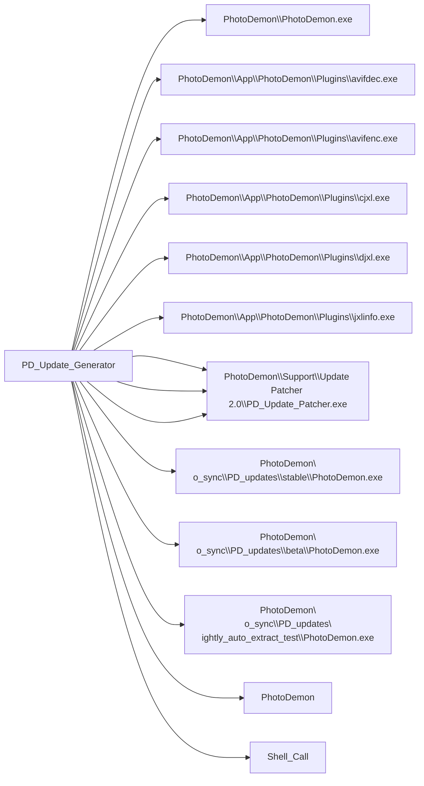

# PD_Update_Generator

## Basic Information
- **Exe Name**: `PhotoDemon_Update_Generator.exe`
- **Project Path**: `../sample_data/photodemon/Support/Update Builder 2.0/PhotoDemon_Update_Generator.vbp`

## At a Glance
- **Executable**: `PhotoDemon_Update_Generator.exe`
- **Forms**: 1
- **Modules**: 9
- **Outbound calls**: 14
- **Jump to**: [Components](#components) | [Connections](#connections)

## Components

=== "Forms (1)"
    - `frmUpdate.frm`

=== "Modules (9)"
    - `Placeholder.bas`
    - `Compression.bas`
    - `Plugin_lz4.bas`
    - `Plugin_ZLib.bas`
    - `Plugin_zstd.bas`
    - `OS.bas`
    - `Strings.bas`
    - `VB_Hacks.bas`
    - `Files.bas`
## Connections
### Outbound Calls
This project calls the following external executables:

| Target | Source File | Line | Context | Content |
| :--- | :--- | :---: | :--- | :--- |
| `PhotoDemon\PhotoDemon.exe` (Unknown) | [frmUpdate.frm](sources/PD_Update_Generator/frmUpdate_frm.md#L187) | 187 | `Set nightlyList = New pdStringStack /  / nightlyList.AddString m_basePath & "PhotoDemon\\PhotoDemon.exe" / nightlyList.AddString m_basePath & "PhotoDemon\\README.md" / nightlyList.AddString m_basePath & "PhotoDemon\\LICENSE.md"` | `nightlyList.AddString m_basePath & "PhotoDemon\\PhotoDemon.exe"` |
| `PhotoDemon\App\PhotoDemon\Plugins\avifdec.exe` (Unknown) | [frmUpdate.frm](sources/PD_Update_Generator/frmUpdate_frm.md#L199) | 199 | ` / 'Manually remove any files we don't want to include in nightly downloads / nightlyList.RemoveStringByText m_basePath & "PhotoDemon\\App\\PhotoDemon\\Plugins\\avifdec.exe", True / nightlyList.RemoveStringByText m_basePath & "PhotoDemon\\App\\PhotoDemon\\Plugins\\avifenc.exe", True / nightlyList.RemoveStringByText m_basePath & "PhotoDemon\\App\\PhotoDemon\\Plugins\\brotlicommon.dll", True` | `nightlyList.RemoveStringByText m_basePath & "PhotoDemon\\App\\PhotoDemon\\Plugins\\avifdec.exe", True` |
| `PhotoDemon\App\PhotoDemon\Plugins\avifenc.exe` (Unknown) | [frmUpdate.frm](sources/PD_Update_Generator/frmUpdate_frm.md#L200) | 200 | `'Manually remove any files we don't want to include in nightly downloads / nightlyList.RemoveStringByText m_basePath & "PhotoDemon\\App\\PhotoDemon\\Plugins\\avifdec.exe", True / nightlyList.RemoveStringByText m_basePath & "PhotoDemon\\App\\PhotoDemon\\Plugins\\avifenc.exe", True / nightlyList.RemoveStringByText m_basePath & "PhotoDemon\\App\\PhotoDemon\\Plugins\\brotlicommon.dll", True / nightlyList.RemoveStringByText m_basePath & "PhotoDemon\\App\\PhotoDemon\\Plugins\\brotlidec.dll", True` | `nightlyList.RemoveStringByText m_basePath & "PhotoDemon\\App\\PhotoDemon\\Plugins\\avifenc.exe", True` |
| `PhotoDemon\App\PhotoDemon\Plugins\cjxl.exe` (Unknown) | [frmUpdate.frm](sources/PD_Update_Generator/frmUpdate_frm.md#L204) | 204 | `nightlyList.RemoveStringByText m_basePath & "PhotoDemon\\App\\PhotoDemon\\Plugins\\brotlidec.dll", True / nightlyList.RemoveStringByText m_basePath & "PhotoDemon\\App\\PhotoDemon\\Plugins\\brotlienc.dll", True / nightlyList.RemoveStringByText m_basePath & "PhotoDemon\\App\\PhotoDemon\\Plugins\\cjxl.exe", True / nightlyList.RemoveStringByText m_basePath & "PhotoDemon\\App\\PhotoDemon\\Plugins\\djxl.exe", True / nightlyList.RemoveStringByText m_basePath & "PhotoDemon\\App\\PhotoDemon\\Plugins\\jxl.dll", True` | `nightlyList.RemoveStringByText m_basePath & "PhotoDemon\\App\\PhotoDemon\\Plugins\\cjxl.exe", True` |
| `PhotoDemon\App\PhotoDemon\Plugins\djxl.exe` (Unknown) | [frmUpdate.frm](sources/PD_Update_Generator/frmUpdate_frm.md#L205) | 205 | `nightlyList.RemoveStringByText m_basePath & "PhotoDemon\\App\\PhotoDemon\\Plugins\\brotlienc.dll", True / nightlyList.RemoveStringByText m_basePath & "PhotoDemon\\App\\PhotoDemon\\Plugins\\cjxl.exe", True / nightlyList.RemoveStringByText m_basePath & "PhotoDemon\\App\\PhotoDemon\\Plugins\\djxl.exe", True / nightlyList.RemoveStringByText m_basePath & "PhotoDemon\\App\\PhotoDemon\\Plugins\\jxl.dll", True / nightlyList.RemoveStringByText m_basePath & "PhotoDemon\\App\\PhotoDemon\\Plugins\\jxl_threads.dll", True` | `nightlyList.RemoveStringByText m_basePath & "PhotoDemon\\App\\PhotoDemon\\Plugins\\djxl.exe", True` |
| `PhotoDemon\App\PhotoDemon\Plugins\jxlinfo.exe` (Unknown) | [frmUpdate.frm](sources/PD_Update_Generator/frmUpdate_frm.md#L208) | 208 | `nightlyList.RemoveStringByText m_basePath & "PhotoDemon\\App\\PhotoDemon\\Plugins\\jxl.dll", True / nightlyList.RemoveStringByText m_basePath & "PhotoDemon\\App\\PhotoDemon\\Plugins\\jxl_threads.dll", True / nightlyList.RemoveStringByText m_basePath & "PhotoDemon\\App\\PhotoDemon\\Plugins\\jxlinfo.exe", True / nightlyList.RemoveStringByText m_basePath & "PhotoDemon\\App\\PhotoDemon\\Plugins\\libjxl-LICENSE.brotli", True / nightlyList.RemoveStringByText m_basePath & "PhotoDemon\\App\\PhotoDemon\\Plugins\\libjxl-LICENSE.giflib", True` | `nightlyList.RemoveStringByText m_basePath & "PhotoDemon\\App\\PhotoDemon\\Plugins\\jxlinfo.exe", True` |
| `PhotoDemon\Support\Update Patcher 2.0\PD_Update_Patcher.exe` (Unknown) | [frmUpdate.frm](sources/PD_Update_Generator/frmUpdate_frm.md#L233) | 233 | ` / 'We also want to add the update patching program itself / nightlyPackage.AutoAddNodeFromFile m_basePath & "PhotoDemon\\Support\\Update Patcher 2.0\\PD_Update_Patcher.exe", 99, "\\PD_Update_Patcher.exe" /  / 'Write the completed package out to the updates folder` | `nightlyPackage.AutoAddNodeFromFile m_basePath & "PhotoDemon\\Support\\Update Patcher 2.0\\PD_Update_Patcher.exe", 99, "\\PD_Update_Patcher.exe"` |
| `PhotoDemon\Support\Update Patcher 2.0\PD_Update_Patcher.exe` (Unknown) | [frmUpdate.frm](sources/PD_Update_Generator/frmUpdate_frm.md#L285) | 285 | `cPackage.PrepareNewPackage 4, PD_PATCH_IDENTIFIER / cPackage.AutoAddNodesFromFolder m_basePath & "PhotoDemon\\no_sync\\PD_Updates\\stable\\", 0 / cPackage.AutoAddNodeFromFile m_basePath & "PhotoDemon\\Support\\Update Patcher 2.0\\PD_Update_Patcher.exe", 99, "\\PD_Update_Patcher.exe" / cPackage.WritePackageToFile m_basePath & "PhotoDemon\\no_sync\\PD_Updates\\stable.pdz2", , True / ` | `cPackage.AutoAddNodeFromFile m_basePath & "PhotoDemon\\Support\\Update Patcher 2.0\\PD_Update_Patcher.exe", 99, "\\PD_Update_Patcher.exe"` |
| `PhotoDemon\Support\Update Patcher 2.0\PD_Update_Patcher.exe` (Unknown) | [frmUpdate.frm](sources/PD_Update_Generator/frmUpdate_frm.md#L292) | 292 | `cPackage.PrepareNewPackage 4, PD_PATCH_IDENTIFIER / cPackage.AutoAddNodesFromFolder m_basePath & "PhotoDemon\\no_sync\\PD_Updates\\beta\\", 0 / cPackage.AutoAddNodeFromFile m_basePath & "PhotoDemon\\Support\\Update Patcher 2.0\\PD_Update_Patcher.exe", 99, "\\PD_Update_Patcher.exe" / cPackage.WritePackageToFile m_basePath & "PhotoDemon\\no_sync\\PD_Updates\\beta.pdz2", , True / ` | `cPackage.AutoAddNodeFromFile m_basePath & "PhotoDemon\\Support\\Update Patcher 2.0\\PD_Update_Patcher.exe", 99, "\\PD_Update_Patcher.exe"` |
| `PhotoDemon\no_sync\PD_updates\stable\PhotoDemon.exe` (Unknown) | [frmUpdate.frm](sources/PD_Update_Generator/frmUpdate_frm.md#L316) | 316 | `'Retrieve stable, beta, developer build versions / Dim vStable As String, vBeta As String, vDev As String / vStable = GetFileVersion_Modified(m_basePath & "PhotoDemon\\no_sync\\PD_updates\\stable\\PhotoDemon.exe") / vBeta = GetFileVersion_Modified(m_basePath & "PhotoDemon\\no_sync\\PD_updates\\beta\\PhotoDemon.exe") / vDev = GetFileVersion_Modified(m_basePath & "PhotoDemon\\no_sync\\PD_updates\\nightly_auto_extract_test\\PhotoDemon.exe")` | `vStable = GetFileVersion_Modified(m_basePath & "PhotoDemon\\no_sync\\PD_updates\\stable\\PhotoDemon.exe")` |
| `PhotoDemon\no_sync\PD_updates\beta\PhotoDemon.exe` (Unknown) | [frmUpdate.frm](sources/PD_Update_Generator/frmUpdate_frm.md#L317) | 317 | `Dim vStable As String, vBeta As String, vDev As String / vStable = GetFileVersion_Modified(m_basePath & "PhotoDemon\\no_sync\\PD_updates\\stable\\PhotoDemon.exe") / vBeta = GetFileVersion_Modified(m_basePath & "PhotoDemon\\no_sync\\PD_updates\\beta\\PhotoDemon.exe") / vDev = GetFileVersion_Modified(m_basePath & "PhotoDemon\\no_sync\\PD_updates\\nightly_auto_extract_test\\PhotoDemon.exe") / ` | `vBeta = GetFileVersion_Modified(m_basePath & "PhotoDemon\\no_sync\\PD_updates\\beta\\PhotoDemon.exe")` |
| `PhotoDemon\no_sync\PD_updates\nightly_auto_extract_test\PhotoDemon.exe` (Unknown) | [frmUpdate.frm](sources/PD_Update_Generator/frmUpdate_frm.md#L318) | 318 | `vStable = GetFileVersion_Modified(m_basePath & "PhotoDemon\\no_sync\\PD_updates\\stable\\PhotoDemon.exe") / vBeta = GetFileVersion_Modified(m_basePath & "PhotoDemon\\no_sync\\PD_updates\\beta\\PhotoDemon.exe") / vDev = GetFileVersion_Modified(m_basePath & "PhotoDemon\\no_sync\\PD_updates\\nightly_auto_extract_test\\PhotoDemon.exe") /  / 'We now want to write these version numbers out to file - specifically, the YAML file that describes` | `vDev = GetFileVersion_Modified(m_basePath & "PhotoDemon\\no_sync\\PD_updates\\nightly_auto_extract_test\\PhotoDemon.exe")` |
| [PhotoDemon](PhotoDemon.md) | [OS.bas](sources/PD_Update_Generator/OS_bas.md#L621) | 621 | `'Conditionally add it to the string stack, depending on the removeExePath setting / If removeExePath Then / If (InStr(1, tmpString, "PhotoDemon.exe", vbBinaryCompare) = 0) Then dstStringStack.AddString tmpString / Else / dstStringStack.AddString tmpString` | `If (InStr(1, tmpString, "PhotoDemon.exe", vbBinaryCompare) = 0) Then dstStringStack.AddString tmpString` |
| `Shell_Call` (Unknown) | [Files.bas](sources/PD_Update_Generator/Files_bas.md) | - | _N/A_ | `leftHandCall=[name=[ShellAndWait], procedure=[name=[ShellAndWait]]]` |

### Dependency Graph

