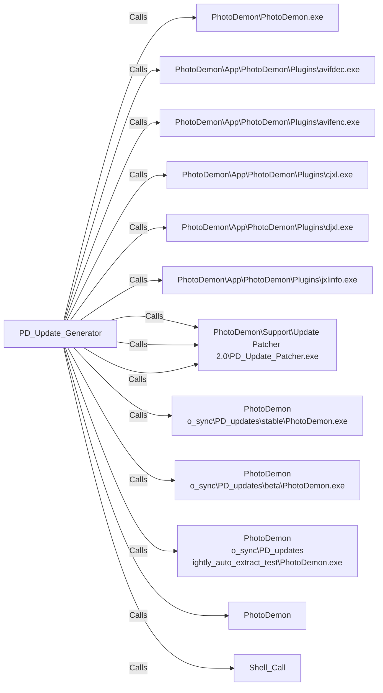

# PD_Update_Generator

## Basic Information
- **Exe Name**: `PhotoDemon_Update_Generator.exe`
- **Project Path**: `../sample_data/photodemon/Support/Update Builder 2.0/PhotoDemon_Update_Generator.vbp`

## Components
### Forms (1)
- `frmUpdate.frm`

### Modules (9)
- `Placeholder.bas`
- `Compression.bas`
- `Plugin_lz4.bas`
- `Plugin_ZLib.bas`
- `Plugin_zstd.bas`
- `OS.bas`
- `Strings.bas`
- `VB_Hacks.bas`
- `Files.bas`
## Connections
### Outbound Calls
This project calls the following external executables:

| Target | Source File | Line | Content |
| :--- | :--- | :---: | :--- |
| `PhotoDemon\PhotoDemon.exe` (Unknown) | `frmUpdate.frm` | 187 | `nightlyList.AddString m_basePath & "PhotoDemon\PhotoDemon.exe"` |
| `PhotoDemon\App\PhotoDemon\Plugins\avifdec.exe` (Unknown) | `frmUpdate.frm` | 199 | `nightlyList.RemoveStringByText m_basePath & "PhotoDemon\App\PhotoDemon\Plugins\avifdec.exe", True` |
| `PhotoDemon\App\PhotoDemon\Plugins\avifenc.exe` (Unknown) | `frmUpdate.frm` | 200 | `nightlyList.RemoveStringByText m_basePath & "PhotoDemon\App\PhotoDemon\Plugins\avifenc.exe", True` |
| `PhotoDemon\App\PhotoDemon\Plugins\cjxl.exe` (Unknown) | `frmUpdate.frm` | 204 | `nightlyList.RemoveStringByText m_basePath & "PhotoDemon\App\PhotoDemon\Plugins\cjxl.exe", True` |
| `PhotoDemon\App\PhotoDemon\Plugins\djxl.exe` (Unknown) | `frmUpdate.frm` | 205 | `nightlyList.RemoveStringByText m_basePath & "PhotoDemon\App\PhotoDemon\Plugins\djxl.exe", True` |
| `PhotoDemon\App\PhotoDemon\Plugins\jxlinfo.exe` (Unknown) | `frmUpdate.frm` | 208 | `nightlyList.RemoveStringByText m_basePath & "PhotoDemon\App\PhotoDemon\Plugins\jxlinfo.exe", True` |
| `PhotoDemon\Support\Update Patcher 2.0\PD_Update_Patcher.exe` (Unknown) | `frmUpdate.frm` | 233 | `nightlyPackage.AutoAddNodeFromFile m_basePath & "PhotoDemon\Support\Update Patcher 2.0\PD_Update_Patcher.exe", 99, "\PD_Update_Patcher.exe"` |
| `PhotoDemon\Support\Update Patcher 2.0\PD_Update_Patcher.exe` (Unknown) | `frmUpdate.frm` | 285 | `cPackage.AutoAddNodeFromFile m_basePath & "PhotoDemon\Support\Update Patcher 2.0\PD_Update_Patcher.exe", 99, "\PD_Update_Patcher.exe"` |
| `PhotoDemon\Support\Update Patcher 2.0\PD_Update_Patcher.exe` (Unknown) | `frmUpdate.frm` | 292 | `cPackage.AutoAddNodeFromFile m_basePath & "PhotoDemon\Support\Update Patcher 2.0\PD_Update_Patcher.exe", 99, "\PD_Update_Patcher.exe"` |
| `PhotoDemon\no_sync\PD_updates\stable\PhotoDemon.exe` (Unknown) | `frmUpdate.frm` | 316 | `vStable = GetFileVersion_Modified(m_basePath & "PhotoDemon\no_sync\PD_updates\stable\PhotoDemon.exe")` |
| `PhotoDemon\no_sync\PD_updates\beta\PhotoDemon.exe` (Unknown) | `frmUpdate.frm` | 317 | `vBeta = GetFileVersion_Modified(m_basePath & "PhotoDemon\no_sync\PD_updates\beta\PhotoDemon.exe")` |
| `PhotoDemon\no_sync\PD_updates\nightly_auto_extract_test\PhotoDemon.exe` (Unknown) | `frmUpdate.frm` | 318 | `vDev = GetFileVersion_Modified(m_basePath & "PhotoDemon\no_sync\PD_updates\nightly_auto_extract_test\PhotoDemon.exe")` |
| [PhotoDemon](PhotoDemon.md) | `OS.bas` | 621 | `If (InStr(1, tmpString, "PhotoDemon.exe", vbBinaryCompare) = 0) Then dstStringStack.AddString tmpString` |
| `Shell_Call` (Unknown) | `Files.bas` | 0 | `leftHandCall=[name=[ShellAndWait], procedure=[name=[ShellAndWait]]]` |

### Dependency Graph

