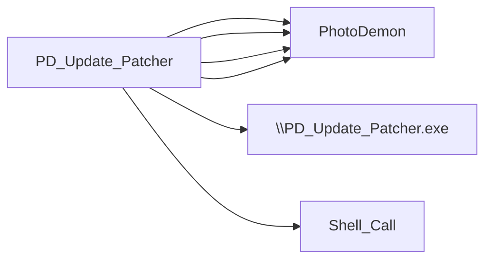

# PD_Update_Patcher

## Basic Information
- **Exe Name**: `PD_Update_Patcher.exe`
- **Project Path**: `../sample_data/photodemon/Support/Update Patcher 2.0/PD_Update_Patcher.vbp`

## At a Glance
- **Executable**: `PD_Update_Patcher.exe`
- **Forms**: 1
- **Modules**: 11
- **Outbound calls**: 6
- **Jump to**: [Components](#components) | [Connections](#connections)

## Components

=== "Forms (1)"
    - `frmPatch.frm`

=== "Modules (11)"
    - `modSupport.bas`
    - `modMain.bas`
    - `Compression.bas`
    - `Files.bas`
    - `OS.bas`
    - `Placeholder.bas`
    - `Plugin_lz4.bas`
    - `Plugin_ZLib.bas`
    - `Plugin_zstd.bas`
    - `Strings.bas`
    - `VB_Hacks.bas`
## Connections
### Outbound Calls
This project calls the following external executables:

| Target | Source File | Line | Context | Content |
| :--- | :--- | :---: | :--- | :--- |
| [PhotoDemon](PhotoDemon.md) | [frmPatch.frm](sources/PD_Update_Patcher/frmPatch_frm.md#L220) | 220 | `szExename = LCase$(Left$(uProcess.szExeFile, i - 1)) /  / 'If the process name is "PhotoDemon.exe", note it / If Right$(szExename, Len("PhotoDemon.exe")) = "PhotoDemon.exe" Then / pdFound = True` | `'If the process name is "PhotoDemon.exe", note it` |
| [PhotoDemon](PhotoDemon.md) | [frmPatch.frm](sources/PD_Update_Patcher/frmPatch_frm.md#L221) | 221 | ` / 'If the process name is "PhotoDemon.exe", note it / If Right$(szExename, Len("PhotoDemon.exe")) = "PhotoDemon.exe" Then / pdFound = True / Exit Do` | `If Right$(szExename, Len("PhotoDemon.exe")) = "PhotoDemon.exe" Then` |
| `\PD_Update_Patcher.exe` (Unknown) | [frmPatch.frm](sources/PD_Update_Patcher/frmPatch_frm.md#L307) | 307 | ` / 'Ignore the patcher itself (it's already extracted and running, obviously!) / If Strings.StringsNotEqual(newFilename, "\\PD_Update_Patcher.exe", True) Then /  / 'Grab the file's bits` | `If Strings.StringsNotEqual(newFilename, "\\PD_Update_Patcher.exe", True) Then` |
| [PhotoDemon](PhotoDemon.md) | [frmPatch.frm](sources/PD_Update_Patcher/frmPatch_frm.md#L508) | 508 | `Dim actionString As String, fileString As String, pathString As String, paramString As String / actionString = "open" / fileString = "PhotoDemon.exe" / pathString = m_PDPath / paramString = ""` | `fileString = "PhotoDemon.exe"` |
| `Shell_Call` (Unknown) | [Files.bas](sources/PD_Update_Patcher/Files_bas.md) | - | _N/A_ | `leftHandCall=[name=[ShellAndWait], procedure=[name=[ShellAndWait]]]` |
| [PhotoDemon](PhotoDemon.md) | [OS.bas](sources/PD_Update_Patcher/OS_bas.md#L621) | 621 | `'Conditionally add it to the string stack, depending on the removeExePath setting / If removeExePath Then / If (InStr(1, tmpString, "PhotoDemon.exe", vbBinaryCompare) = 0) Then dstStringStack.AddString tmpString / Else / dstStringStack.AddString tmpString` | `If (InStr(1, tmpString, "PhotoDemon.exe", vbBinaryCompare) = 0) Then dstStringStack.AddString tmpString` |

### Dependency Graph

