# PhotoDemon

## Basic Information
- **Exe Name**: `PhotoDemon.exe`
- **Project Path**: `../sample_data/photodemon/PhotoDemon.vbp`

## Components
### Forms (227)
- `MainWindow.frm`
- `Adjustments_BlackAndWhite.frm`
- `Adjustments_BrightnessContrast.frm`
- `Adjustments_Channel_ChannelMixer.frm`
- `Adjustments_Channel_Rechannel.frm`
- `Adjustments_ColorBalance.frm`
- `Adjustments_Color_Colorize.frm`
- `Adjustments_Color_Grayscale.frm`
- `Adjustments_Color_HSL.frm`
- `Adjustments_Color_Lookup.frm`
- `Adjustments_Color_ReplaceColor.frm`
- `Adjustments_Color_Sepia.frm`
- `Adjustments_Color_Temperature.frm`
- `Adjustments_Color_Tint.frm`
- `Adjustments_Color_Vibrance.frm`
- `Adjustments_Curves.frm`
- `Adjustments_Histogram_DisplayHistogram.frm`
- `Adjustments_Histogram_Equalize.frm`
- `Adjustments_Levels.frm`
- `Adjustments_Lighting_Dehaze.frm`
- `Adjustments_Lighting_Exposure.frm`
- `Adjustments_Lighting_Gamma.frm`
- `Adjustments_Map_Gradient.frm`
- `Adjustments_Monochrome_MonoToGray.frm`
- `Adjustments_Photo_HDR.frm`
- `Adjustments_Photo_PhotoFilters.frm`
- `Adjustments_Photo_SplitTone.frm`
- `Adjustments_ShadowAndHighlight.frm`
- `Adjustments_WhiteBalance.frm`
- `Dialog_AutosaveFound.frm`
- `Dialog_ColorPanel.frm`
- `Dialog_ColorSelector.frm`
- `Dialog_EditPreset.frm`
- `Dialog_FillSettings.frm`
- `Dialog_GenericRemember.frm`
- `Dialog_GenericWait.frm`
- `Dialog_GradientEditor.frm`
- `Dialog_IDEWarning.frm`
- `Dialog_ImportPDF.frm`
- `Dialog_InputBox.frm`
- `Dialog_MsgBox.frm`
- `Dialog_OutlineSettings.frm`
- `Dialog_SVGImport.frm`
- `Dialog_ToneMapping.frm`
- `Dialog_UITheme.frm`
- `Dialog_UnsavedChanges.frm`
- `Dialog_UpdateAvailable.frm`
- `Edit_Clipboard.frm`
- `Edit_ContentAwareFill.frm`
- `Edit_Fade.frm`
- `Edit_Fill.frm`
- `Edit_Stroke.frm`
- `Edit_UndoHistory.frm`
- `Effects_8bf.frm`
- `Effects_Animation_Background.frm`
- `Effects_Animation_Speed.frm`
- `Effects_Artistic_ColoredPencil.frm`
- `Effects_Artistic_ComicBook.frm`
- `Effects_Artistic_FiguredGlass.frm`
- `Effects_Artistic_FilmNoir.frm`
- `Effects_Artistic_GlassTiles.frm`
- `Effects_Artistic_Kaleidoscope.frm`
- `Effects_Artistic_ModernArt.frm`
- `Effects_Artistic_OilPainting.frm`
- `Effects_Artistic_PlasticWrap.frm`
- `Effects_Artistic_Posterize.frm`
- `Effects_Artistic_Relief.frm`
- `Effects_Artistic_StainedGlass.frm`
- `Effects_Blur_BoxBlur.frm`
- `Effects_Blur_GaussianBlur.frm`
- `Effects_Blur_Kuwahara.frm`
- `Effects_Blur_MotionBlur.frm`
- `Effects_Blur_RadialBlur.frm`
- `Effects_Blur_SNN.frm`
- `Effects_Blur_SurfaceBlur.frm`
- `Effects_Blur_ZoomBlur.frm`
- `Effects_CustomFilter.frm`
- `Effects_Distort_ApplyLens.frm`
- `Effects_Distort_CorrectLens.frm`
- `Effects_Distort_Donut.frm`
- `Effects_Distort_Droste.frm`
- `Effects_Distort_Miscellaneous.frm`
- `Effects_Distort_Pinch.frm`
- `Effects_Distort_Poke.frm`
- `Effects_Distort_Ripple.frm`
- `Effects_Distort_Squish.frm`
- `Effects_Distort_Swirl.frm`
- `Effects_Distort_Waves.frm`
- `Effects_Edge_Emboss.frm`
- `Effects_Edge_EnhanceEdges.frm`
- `Effects_Edge_FindEdges.frm`
- `Effects_Edge_GradientFlow.frm`
- `Effects_Edge_Range.frm`
- `Effects_Edge_TraceContour.frm`
- `Effects_LightAndShadow_BlackLight.frm`
- `Effects_LightAndShadow_BumpMap.frm`
- `Effects_LightAndShadow_CrossScreen.frm`
- `Effects_LightAndShadow_Rainbow.frm`
- `Effects_LightAndShadow_Sunshine.frm`
- `Effects_Nature_Atmosphere.frm`
- `Effects_Nature_Fog.frm`
- `Effects_Nature_Ignite.frm`
- `Effects_Nature_Lava.frm`
- `Effects_Nature_Metal.frm`
- `Effects_Nature_Snow.frm`
- `Effects_Nature_Water.frm`
- `Effects_Noise_AddRGBNoise.frm`
- `Effects_Noise_Anisotropic.frm`
- `Effects_Noise_DustAndScratches.frm`
- `Effects_Noise_FilmGrain.frm`
- `Effects_Noise_HarmonicMean.frm`
- `Effects_Noise_MeanShift.frm`
- `Effects_Noise_MedianSmoothing.frm`
- `Effects_Pixelate_ColorHalftone.frm`
- `Effects_Pixelate_Crystallize.frm`
- `Effects_Pixelate_Fragment.frm`
- `Effects_Pixelate_Mezzotint.frm`
- `Effects_Pixelate_Mosaic.frm`
- `Effects_Pixelate_Pointillize.frm`
- `Effects_Render_Clouds.frm`
- `Effects_Render_Fibers.frm`
- `Effects_Render_Truchet.frm`
- `Effects_Sharpen_Sharpen.frm`
- `Effects_Sharpen_UnsharpMask.frm`
- `Effects_Stylize_Antique.frm`
- `Effects_Stylize_Diffuse.frm`
- `Effects_Stylize_Outline.frm`
- `Effects_Stylize_Palettize.frm`
- `Effects_Stylize_PortraitGlow.frm`
- `Effects_Stylize_Solarize.frm`
- `Effects_Stylize_Twins.frm`
- `Effects_Stylize_Vignette.frm`
- `Effects_Transform_PanZoom.frm`
- `Effects_Transform_Perspective.frm`
- `Effects_Transform_PolarCoords.frm`
- `Effects_Transform_Rotate.frm`
- `Effects_Transform_Shear.frm`
- `Effects_Transform_Sphere.frm`
- `File_BatchRepair.frm`
- `File_BatchWizard.frm`
- `File_Export_AnimatedGIF.frm`
- `File_Export_AnimatedJXL.frm`
- `File_Export_AnimatedPNG.frm`
- `File_Export_AnimatedWebP.frm`
- `File_Export_Layers.frm`
- `File_Export_LUT.frm`
- `File_Export_Palette.frm`
- `File_Import_FromInternet.frm`
- `File_Import_ScreenCapture.frm`
- `File_New.frm`
- `File_PrintXP.frm`
- `File_Save_AVIF.frm`
- `File_Save_BMP.frm`
- `File_Save_DDS.frm`
- `File_Save_GIF.frm`
- `File_Save_HEIF.frm`
- `File_Save_ICO.frm`
- `File_Save_JP2.frm`
- `File_Save_JPG.frm`
- `File_Save_JXL.frm`
- `File_Save_JXR.frm`
- `File_Save_Pixmap.frm`
- `File_Save_PNG.frm`
- `File_Save_PSD.frm`
- `File_Save_PSP.frm`
- `File_Save_TIFF.frm`
- `File_Save_WebP.frm`
- `Help_About.frm`
- `Image_Animation.frm`
- `Image_CanvasSize.frm`
- `Image_Compare.frm`
- `Image_ContentAwareResize.frm`
- `Image_CreateLUT.frm`
- `Image_Metadata.frm`
- `Image_Resize.frm`
- `Image_Rotate.frm`
- `Image_Straighten.frm`
- `Layer_Add_RasterLayer.frm`
- `Layer_Flatten.frm`
- `Layer_Split_ImagesToLayers.frm`
- `Layer_Transparency_GreenScreen.frm`
- `Layer_Transparency_Luma.frm`
- `Layer_Transparency_RemoveTransparency.frm`
- `Layer_Transparency_Threshold.frm`
- `Layerpanel_Colors.frm`
- `Layerpanel_Layers.frm`
- `Layerpanel_Navigator.frm`
- `Layerpanel_Search.frm`
- `Misc_Tooltip.frm`
- `Select_GenericModification.frm`
- `Startup_Splash.frm`
- `Toolbar_Layers.frm`
- `Toolbar_ToolOptionsContainer.frm`
- `Toolbar_ToolSelect.frm`
- `Toolpanel_Clone.frm`
- `Toolpanel_ColorPicker.frm`
- `Toolpanel_Crop.frm`
- `Toolpanel_Eraser.frm`
- `Toolpanel_Fill.frm`
- `Toolpanel_Gradient.frm`
- `Toolpanel_Measure.frm`
- `Toolpanel_MoveSize.frm`
- `Toolpanel_Paintbrush.frm`
- `Toolpanel_Pencil.frm`
- `Toolpanel_Selections.frm`
- `Toolpanel_TextBasic.frm`
- `Toolpanel_Typography.frm`
- `Tools_BuildPackage.frm`
- `Tools_Hotkeys.frm`
- `Tools_LanguageEditor.frm`
- `Tools_MacroSession.frm`
- `Tools_Options.frm`
- `Tools_PluginManager.frm`
- `Tools_ScreenVideo.frm`
- `Tools_ScreenVideoPrefs.frm`
- `Tools_ThemeEditor.frm`
- `Options_Interface.frm`
- `Options_Loading.frm`
- `Options_Saving.frm`
- `Options_Performance.frm`
- `Options_ColorManagement.frm`
- `Options_Updates.frm`
- `Options_Advanced.frm`
- `Options_Fonts.frm`
- `Options_Input.frm`
- `Options_Menus.frm`
- `Options_Metadata.frm`

### Modules (114)
- `Main.bas`
- `PublicConstants.bas`
- `PublicEnumsAndTypes.bas`
- `PublicVars.bas`
- `Actions.bas`
- `Animation.bas`
- `AutosaveEngine.bas`
- `CanvasManager.bas`
- `ColorManagement_ICM.bas`
- `Colors.bas`
- `ComplexNumbers.bas`
- `Compression.bas`
- `DialogManager.bas`
- `DibSupport.bas`
- `Drawing.bas`
- `Drawing2D.bas`
- `EffectPrep.bas`
- `Evaluator.bas`
- `Plugin_ExifTool.bas`
- `FileMenu.bas`
- `Files.bas`
- `Filters_Color.bas`
- `Filters_Area.bas`
- `Filters_ByteArray.bas`
- `Filters_Edge.bas`
- `Filters_Layers.bas`
- `Filters_Misc.bas`
- `Filters_Natural.bas`
- `Filters_Render.bas`
- `Filters_Scientific.bas`
- `Filters_Stylize.bas`
- `Filters_Transform.bas`
- `Fonts.bas`
- `GDI.bas`
- `GDIPlus.bas`
- `Histograms.bas`
- `Hotkeys.bas`
- `IconsAndCursors.bas`
- `ImageExporter.bas`
- `ImageFormats.bas`
- `ImageFormats_GIF.bas`
- `ImageFormats_GIF_LZW.bas`
- `ImageFormats_PSP.bas`
- `ImageLoader.bas`
- `Interface.bas`
- `Layers.bas`
- `Legacy.bas`
- `Plugin_LittleCMS.bas`
- `Loading.bas`
- `BatchProcessor.bas`
- `Menus.bas`
- `Mutex.bas`
- `NavKey.bas`
- `OS.bas`
- `FreeImageWrapper.bas`
- `Palettes.bas`
- `PD2D.bas`
- `Debug.bas`
- `PDImages.bas`
- `PDMath.bas`
- `PDPackaging.bas`
- `Plugin_8bf.bas`
- `Plugin_AVIF.bas`
- `Plugin_CharLS.bas`
- `Plugin_DDS.bas`
- `Plugin_EZTwain.bas`
- `Plugin_FreeImage.bas`
- `Plugin_heif.bas`
- `Plugin_jxl.bas`
- `Plugin_libdeflate.bas`
- `Plugin_lz4.bas`
- `Plugin_OpenJPEG.bas`
- `Plugin_PDF.bas`
- `Plugin_resvg.bas`
- `Plugin_WebP.bas`
- `Plugin_zstd.bas`
- `Plugin_Management.bas`
- `Printing.bas`
- `Processor.bas`
- `ProgressBars.bas`
- `Resampling.bas`
- `Saving.bas`
- `ScreenCapture.bas`
- `SelectionFiles.bas`
- `SelectionFilters.bas`
- `Selections.bas`
- `SelectionUI.bas`
- `Snap.bas`
- `Strings.bas`
- `TextSupport.bas`
- `Toolboxes.bas`
- `Tools.bas`
- `Clonestamp.bas`
- `ColorPicker.bas`
- `Tools_Crop.bas`
- `FillTool.bas`
- `GradientTool.bas`
- `MeasureTool.bas`
- `MoveTool.bas`
- `Paintbrush.bas`
- `PencilTool.bas`
- `TextTools.bas`
- `ZoomTool.bas`
- `UIImages.bas`
- `Uniscribe.bas`
- `Units.bas`
- `UpdateEngine.bas`
- `UserControl_Support.bas`
- `UserPrefs.bas`
- `VB_Hacks.bas`
- `ViewportEngine.bas`
- `Web.bas`
- `WIC.bas`
- `Zoom.bas`
## Connections
### Outbound Calls
This project calls the following external executables:

| Target | Source File | Line | Content |
| :--- | :--- | :---: | :--- |
| `explorer.exe` (Unknown) | `Adjustments_Color_Lookup.frm` | 454 | `shellCommand = "explorer.exe """ & filePath & """"` |
| `explorer.exe` (Unknown) | `Dialog_GradientEditor.frm` | 1732 | `shellCommand = "explorer.exe """ & filePath & """"` |
| `If you insist on running PhotoDemon in the IDE, please do not submit bugs regarding IDE crashes or freezes.  PhotoDemon's developers can only address issues and bugs that affect the compiled .exe` (Unknown) | `Dialog_IDEWarning.frm` | 157 | `strDialog(3) = "If you insist on running PhotoDemon in the IDE, please do not submit bugs regarding IDE crashes or freezes.  PhotoDemon's developers can only address issues and bugs that affect the compiled .exe."` |
| `explorer.exe` (Unknown) | `Effects_8bf.frm` | 508 | `shellCommand = "explorer.exe """ & filePath & """"` |
| `explorer.exe` (Unknown) | `Tools_PluginManager.frm` | 634 | `shellCommand = "explorer.exe """ & filePath & """"` |
| `2) Extract the zip file's contents to a folder on your PC.  Make sure both PhotoDemon.exe` (Unknown) | `Main.bas` | 374 | `tmpMsg.AppendLine "2) Extract the zip file's contents to a folder on your PC.  Make sure both PhotoDemon.exe and its /App subfolder are extracted."` |
| `3) Double-click the new PhotoDemon.exe` (Unknown) | `Main.bas` | 375 | `tmpMsg.AppendLine "3) Double-click the new PhotoDemon.exe file."` |
| `Shell_Call` (Unknown) | `Main.bas` | 0 | `leftHandCall=[name=[strShellName], variable=[name=[strShellName]]]` |
| `Shell_Call` (Unknown) | `Main.bas` | 0 | `leftHandCall=[name=[m_hShellModule], variable=[name=[m_hShellModule]]]` |
| `exiftool.exe` (Unknown) | `Plugin_ExifTool.bas` | 10 | `' which can be found in the App/PhotoDemon/Plugins subdirectory as "exiftool.exe".  The ExifTool plugin is` |
| `exiftool.exe` (Unknown) | `Plugin_ExifTool.bas` | 585 | `Const EXIFTOOL_EXE_NAME As String = "exiftool.exe"` |
| `exiftool.exe` (Unknown) | `Plugin_ExifTool.bas` | 1472 | `appLocation = PluginManager.GetPluginPath & "exiftool.exe"` |
| `exiftool.exe` (Unknown) | `Plugin_ExifTool.bas` | 1479 | `cmdParams = cmdParams & "exiftool.exe -stay_open true -@ -"` |
| `exiftool.exe` (Unknown) | `Plugin_ExifTool.bas` | 1556 | `procTarget = "exiftool.exe"` |
| `exiftool.exe` (Unknown) | `Plugin_ExifTool.bas` | 1567 | `'If the process name is "exiftool.exe", terminate it` |
| `Shell_Call` (Unknown) | `Plugin_ExifTool.bas` | 0 | `leftHandCall=[name=[cShell], variable=[name=[cShell]]]` |
| `Shell_Call` (Unknown) | `Files.bas` | 0 | `leftHandCall=[name=[ShellAndWait], procedure=[name=[ShellAndWait]]]` |
| [PhotoDemon](PhotoDemon.md) | `OS.bas` | 620 | `If (InStr(1, tmpString, "PhotoDemon.exe", vbBinaryCompare) = 0) Then dstStringStack.AddString tmpString` |
| `avifdec.exe` (Unknown) | `Plugin_AVIF.bas` | 56 | `pluginPath = PluginManager.GetPluginPath & "avifdec.exe"` |
| `avifdec.exe` (Unknown) | `Plugin_AVIF.bas` | 83 | `shellCmd.Append "avifdec.exe "` |
| `avifenc.exe` (Unknown) | `Plugin_AVIF.bas` | 174 | `pluginPath = PluginManager.GetPluginPath & "avifenc.exe"` |
| `avifenc.exe` (Unknown) | `Plugin_AVIF.bas` | 189 | `shellCmd.Append "avifenc.exe "` |
| `avifenc.exe` (Unknown) | `Plugin_AVIF.bas` | 333 | `targetAvifAppName = "avifenc.exe"` |
| `avifdec.exe` (Unknown) | `Plugin_AVIF.bas` | 335 | `targetAvifAppName = "avifdec.exe"` |
| `avifdec.exe` (Unknown) | `Plugin_AVIF.bas` | 414 | `importPath = pathToDLLFolder & "avifdec.exe"` |
| `avifenc.exe` (Unknown) | `Plugin_AVIF.bas` | 415 | `exportPath = pathToDLLFolder & "avifenc.exe"` |
| `avifdec.exe` (Unknown) | `Plugin_AVIF.bas` | 562 | `uiMsg.AppendLine g_Language.TranslateMessage("To manually enable AVIF support, you can download the latest copies of the free ""%1"" and ""%2"" programs and place them into your PhotoDemon plugin folder:", "avifdec.exe", "avifenc.exe")` |
| `Shell_Call` (Unknown) | `Plugin_AVIF.bas` | 0 | `leftHandCall=[name=[shellCmd], variable=[name=[shellCmd]]]` |
| `Shell_Call` (Unknown) | `Plugin_AVIF.bas` | 0 | `leftHandCall=[name=[cShell], variable=[name=[cShell]]]` |
| `Shell_Call` (Unknown) | `Plugin_AVIF.bas` | 0 | `leftHandCall=[name=[shellCmd], variable=[name=[shellCmd]]]` |
| `Shell_Call` (Unknown) | `Plugin_AVIF.bas` | 0 | `leftHandCall=[name=[cShell], variable=[name=[cShell]]]` |
| `Shell_Call` (Unknown) | `Plugin_AVIF.bas` | 0 | `leftHandCall=[name=[cShell], variable=[name=[cShell]]]` |
| `texdiag.exe` (Unknown) | `Plugin_DDS.bas` | 45 | `'PD ships with the additional "texdiag.exe" command-line app, which we can use to query some DDS info` |
| `texconv.exe` (Unknown) | `Plugin_DDS.bas` | 67 | `pluginPath = PluginManager.GetPluginPath & "texconv.exe"` |
| `texconv.exe` (Unknown) | `Plugin_DDS.bas` | 144 | `shellCmd.Append "texconv.exe "` |
| `texconv.exe` (Unknown) | `Plugin_DDS.bas` | 262 | `pluginPath = PluginManager.GetPluginPath & "texconv.exe"` |
| `texconv.exe` (Unknown) | `Plugin_DDS.bas` | 325 | `shellCmd.Append "texconv.exe "` |
| `texconv.exe` (Unknown) | `Plugin_DDS.bas` | 454 | `m_LibFullPath = pathToDLLFolder & "texconv.exe"` |
| `texdiag.exe` (Unknown) | `Plugin_DDS.bas` | 459 | `m_pathToTexDiag = pathToDLLFolder & "texdiag.exe"` |
| `texconv.exe` (Unknown) | `Plugin_DDS.bas` | 537 | `shellCmd.Append "texconv.exe info "` |
| `texconv.exe` (Unknown) | `Plugin_DDS.bas` | 588 | `' (You can pull a full list of supported IDs by running "./texconv.exe -h";` |
| `Shell_Call` (Unknown) | `Plugin_DDS.bas` | 0 | `leftHandCall=[name=[shellCmd], variable=[name=[shellCmd]]]` |
| `Shell_Call` (Unknown) | `Plugin_DDS.bas` | 0 | `leftHandCall=[name=[cShell], variable=[name=[cShell]]]` |
| `Shell_Call` (Unknown) | `Plugin_DDS.bas` | 0 | `leftHandCall=[name=[shellCmd], variable=[name=[shellCmd]]]` |
| `Shell_Call` (Unknown) | `Plugin_DDS.bas` | 0 | `leftHandCall=[name=[cShell], variable=[name=[cShell]]]` |
| `Shell_Call` (Unknown) | `Plugin_DDS.bas` | 0 | `leftHandCall=[name=[shellCmd], variable=[name=[shellCmd]]]` |
| `Shell_Call` (Unknown) | `Plugin_DDS.bas` | 0 | `leftHandCall=[name=[cShell], variable=[name=[cShell]]]` |
| `heif-enc.exe` (Unknown) | `Plugin_heif.bas` | 25 | `' encoding parameters reported by heif-enc (as listed via "./heif-enc.exe -P")` |
| `djxl.exe` (Unknown) | `Plugin_jxl.bas` | 55 | `importPath = pathToDLLFolder & "djxl.exe"` |
| `cjxl.exe` (Unknown) | `Plugin_jxl.bas` | 56 | `exportPath = pathToDLLFolder & "cjxl.exe"` |
| `jxlinfo.exe` (Unknown) | `Plugin_jxl.bas` | 63 | `supportFilesOK = Files.FileExists(pathToDLLFolder & "jxlinfo.exe")` |
| `djxl.exe` (Unknown) | `Plugin_jxl.bas` | 89 | `If Files.FileExists(PluginManager.GetPluginPath & "djxl.exe") And OS.IsVistaOrLater Then` |
| `djxl.exe` (Unknown) | `Plugin_jxl.bas` | 92 | `pluginExeAndPath = PluginManager.GetPluginPath() & "djxl.exe"` |
| `djxl.exe` (Unknown) | `Plugin_jxl.bas` | 98 | `shellCmd.Append "djxl.exe --version"` |
| `cjxl.exe` (Unknown) | `Plugin_jxl.bas` | 160 | `pluginExeAndPath = PluginManager.GetPluginPath() & "cjxl.exe"` |
| `cjxl.exe` (Unknown) | `Plugin_jxl.bas` | 175 | `shellCmd.Append "cjxl.exe "` |
| `cjxl.exe` (Unknown) | `Plugin_jxl.bas` | 187 | `'Retrieve parameters from incoming string.  Magic-number constants are taken directly from libjxl via "cjxl.exe -h"` |
| `cjxl.exe` (Unknown) | `Plugin_jxl.bas` | 197 | `'Sanity check inputs.  Again, magic-number constants are taken directly from libjxl via "cjxl.exe -h"` |
| `cjxl.exe` (Unknown) | `Plugin_jxl.bas` | 232 | `If JXL_DEBUG_VERBOSE Then PDDebug.LogAction "cjxl.exe returned: " & outputString` |
| `djxl.exe` (Unknown) | `Plugin_jxl.bas` | 261 | `pluginExeAndPath = PluginManager.GetPluginPath() & "djxl.exe"` |
| `djxl.exe` (Unknown) | `Plugin_jxl.bas` | 278 | `shellCmd.Append "djxl.exe "` |
| `failed to shell decoder (djxl.exe` (Unknown) | `Plugin_jxl.bas` | 322 | `InternalError FUNC_NAME, "failed to shell decoder (djxl.exe)"` |
| `jxlinfo.exe` (Unknown) | `Plugin_jxl.bas` | 389 | `pluginExeAndPath = PluginManager.GetPluginPath() & "jxlinfo.exe"` |
| `jxlinfo.exe` (Unknown) | `Plugin_jxl.bas` | 395 | `shellCmd.Append "jxlinfo.exe "` |
| `djxl.exe` (Unknown) | `Plugin_jxl.bas` | 439 | `pluginExeAndPath = PluginManager.GetPluginPath() & "djxl.exe"` |
| `djxl.exe` (Unknown) | `Plugin_jxl.bas` | 456 | `shellCmd.Append "djxl.exe "` |
| `failed to shell decoder (djxl.exe` (Unknown) | `Plugin_jxl.bas` | 565 | `InternalError FUNC_NAME, "failed to shell decoder (djxl.exe)"` |
| `cjxl.exe` (Unknown) | `Plugin_jxl.bas` | 597 | `pluginExeAndPath = PluginManager.GetPluginPath() & "cjxl.exe"` |
| `cjxl.exe` (Unknown) | `Plugin_jxl.bas` | 612 | `shellCmd.Append "cjxl.exe "` |
| `cjxl.exe` (Unknown) | `Plugin_jxl.bas` | 627 | `'Retrieve parameters from incoming string.  Magic-number constants are taken directly from libjxl via "cjxl.exe -h"` |
| `cjxl.exe` (Unknown) | `Plugin_jxl.bas` | 641 | `'Sanity check inputs.  Again, magic-number constants are taken directly from libjxl via "cjxl.exe -h"` |
| `cjxl.exe` (Unknown) | `Plugin_jxl.bas` | 672 | `If JXL_DEBUG_VERBOSE Then PDDebug.LogAction "cjxl.exe returned: " & outputString` |
| `Shell_Call` (Unknown) | `Plugin_jxl.bas` | 0 | `leftHandCall=[name=[shellCmd], variable=[name=[shellCmd]]]` |
| `Shell_Call` (Unknown) | `Plugin_jxl.bas` | 0 | `leftHandCall=[name=[cShell], variable=[name=[cShell]]]` |
| `Shell_Call` (Unknown) | `Plugin_jxl.bas` | 0 | `leftHandCall=[name=[shellCmd], variable=[name=[shellCmd]]]` |
| `Shell_Call` (Unknown) | `Plugin_jxl.bas` | 0 | `leftHandCall=[name=[cShell], variable=[name=[cShell]]]` |
| `Shell_Call` (Unknown) | `Plugin_jxl.bas` | 0 | `leftHandCall=[name=[shellCmd], variable=[name=[shellCmd]]]` |
| `Shell_Call` (Unknown) | `Plugin_jxl.bas` | 0 | `leftHandCall=[name=[cShell], variable=[name=[cShell]]]` |
| `Shell_Call` (Unknown) | `Plugin_jxl.bas` | 0 | `leftHandCall=[name=[shellCmd], variable=[name=[shellCmd]]]` |
| `Shell_Call` (Unknown) | `Plugin_jxl.bas` | 0 | `leftHandCall=[name=[cShell], variable=[name=[cShell]]]` |
| `Shell_Call` (Unknown) | `Plugin_jxl.bas` | 0 | `leftHandCall=[name=[shellCmd], variable=[name=[shellCmd]]]` |
| `Shell_Call` (Unknown) | `Plugin_jxl.bas` | 0 | `leftHandCall=[name=[cShell], variable=[name=[cShell]]]` |
| `Shell_Call` (Unknown) | `Plugin_jxl.bas` | 0 | `leftHandCall=[name=[shellCmd], variable=[name=[shellCmd]]]` |
| `Shell_Call` (Unknown) | `Plugin_jxl.bas` | 0 | `leftHandCall=[name=[cShell], variable=[name=[cShell]]]` |
| `texconv.exe` (Unknown) | `Plugin_Management.bas` | 239 | `GetPluginFilename = "texconv.exe"` |
| `exiftool.exe` (Unknown) | `Plugin_Management.bas` | 241 | `GetPluginFilename = "exiftool.exe"` |
| `avifdec.exe` (Unknown) | `Plugin_Management.bas` | 247 | `GetPluginFilename = "avifdec.exe"` |
| `djxl.exe` (Unknown) | `Plugin_Management.bas` | 253 | `GetPluginFilename = "djxl.exe"` |
| `texdiag.exe` (Unknown) | `Plugin_Management.bas` | 418 | `dstStringStack.AddString "texdiag.exe"` |
| `avifenc.exe` (Unknown) | `Plugin_Management.bas` | 430 | `dstStringStack.AddString "avifenc.exe"` |
| `cjxl.exe` (Unknown) | `Plugin_Management.bas` | 442 | `dstStringStack.AddString "cjxl.exe"` |
| `jxlinfo.exe` (Unknown) | `Plugin_Management.bas` | 443 | `dstStringStack.AddString "jxlinfo.exe"` |
| `Shell_Call` (Unknown) | `Printing.bas` | 0 | `name=[ShellExecuteW]` |
| `\PD_Update_Patcher.exe` (Unknown) | `UpdateEngine.bas` | 366 | `patchFileName = "\PD_Update_Patcher.exe"` |
| [PD_Update_Patcher](PD_Update_Patcher.md) | `UpdateEngine.bas` | 467 | `Files.FileDeleteIfExists UserPrefs.GetProgramPath & "PD_Update_Patcher.exe"` |
| [PD_Update_Patcher](PD_Update_Patcher.md) | `UpdateEngine.bas` | 477 | `restartFile = UserPrefs.GetProgramPath & "PD_Update_Patcher.exe"` |
| `Shell_Call` (Unknown) | `UpdateEngine.bas` | 0 | `leftHandCall=[name=[shellReturn], variable=[name=[shellReturn]]]` |
| `Shell_Call` (Unknown) | `Web.bas` | 0 | `name=[ShellExecuteW]` |
| `Shell_Call` (Unknown) | `cFileDialogVista.cls` | 0 | `leftHandCall=[name=[oIShellItem], variable=[name=[oIShellItem]]]` |
| `Shell_Call` (Unknown) | `cFileDialogVista.cls` | 0 | `leftHandCall=[name=[oIShellItem], variable=[name=[oIShellItem]]]` |
| `Shell_Call` (Unknown) | `cFileDialogVista.cls` | 0 | `leftHandCall=[name=[oIShellItem], variable=[name=[oIShellItem]]]` |
| `Shell_Call` (Unknown) | `cFileDialogVista.cls` | 0 | `leftHandCall=[name=[oIShellItem], variable=[name=[oIShellItem]]]` |
| `Shell_Call` (Unknown) | `cFileDialogVista.cls` | 0 | `leftHandCall=[name=[oIShellItem], variable=[name=[oIShellItem]]]` |
| `Shell_Call` (Unknown) | `cFileDialogVista.cls` | 0 | `leftHandCall=[name=[oIShellItem], variable=[name=[oIShellItem]]]` |
| `Shell_Call` (Unknown) | `cFileDialogVista.cls` | 0 | `leftHandCall=[name=[IShellItem_GetDisplayName], procedure=[name=[IShellItem_GetDisplayName]]]` |
| `Shell_Call` (Unknown) | `cFileDialogVista.cls` | 0 | `leftHandCall=[name=[IShellItem_GetDisplayName], procedure=[name=[IShellItem_GetDisplayName]]]` |
| `Shell_Call` (Unknown) | `cFileDialogVista.cls` | 0 | `leftHandCall=[name=[IShellItem_GetParent], procedure=[name=[IShellItem_GetParent]]]` |
| `Shell_Call` (Unknown) | `cFileDialogVista.cls` | 0 | `leftHandCall=[name=[IShellItem_AreEqual], procedure=[name=[IShellItem_AreEqual]]]` |
| `Shell_Call` (Unknown) | `cFileDialogVista.cls` | 0 | `leftHandCall=[name=[IShellItem_PointerToVBObject], procedure=[name=[IShellItem_PointerToVBObject]]]` |
| `Shell_Call` (Unknown) | `cFileDialogVista.cls` | 0 | `leftHandCall=[name=[pvGetIShellItem], procedure=[name=[pvGetIShellItem]]]` |
| `Shell_Call` (Unknown) | `cFileDialogVista.cls` | 0 | `leftHandCall=[name=[pvGetIShellItem], procedure=[name=[pvGetIShellItem]]]` |
| `Shell_Call` (Unknown) | `cFileDialogVista.cls` | 0 | `leftHandCall=[name=[pvGetIShellItem], procedure=[name=[pvGetIShellItem]]]` |

### Dependency Graph

```mermaid
graph LR
  Current["PhotoDemon"]
  Current --> explorerexe["explorer.exe"]
  Current --> explorerexe["explorer.exe"]
  Current --> N1691975233["If you insist on running PhotoDemon in the IDE, please do not submit bugs reg..."]
  Current --> explorerexe["explorer.exe"]
  Current --> explorerexe["explorer.exe"]
  Current --> N212431334["2) Extract the zip file's contents to a folder on your PC.  Make sure both Ph..."]
  Current --> N338627158["3) Double-click the new PhotoDemon.exe"]
  Current --> ShellCall["Shell_Call"]
  Current --> ShellCall["Shell_Call"]
  Current --> exiftoolexe["exiftool.exe"]
  Current --> exiftoolexe["exiftool.exe"]
  Current --> exiftoolexe["exiftool.exe"]
  Current --> exiftoolexe["exiftool.exe"]
  Current --> exiftoolexe["exiftool.exe"]
  Current --> exiftoolexe["exiftool.exe"]
  Current --> ShellCall["Shell_Call"]
  Current --> ShellCall["Shell_Call"]
  Current --> PhotoDemon["PhotoDemon"]
  Current --> avifdecexe["avifdec.exe"]
  Current --> avifdecexe["avifdec.exe"]
  Current --> avifencexe["avifenc.exe"]
  Current --> avifencexe["avifenc.exe"]
  Current --> avifencexe["avifenc.exe"]
  Current --> avifdecexe["avifdec.exe"]
  Current --> avifdecexe["avifdec.exe"]
  Current --> avifencexe["avifenc.exe"]
  Current --> avifdecexe["avifdec.exe"]
  Current --> ShellCall["Shell_Call"]
  Current --> ShellCall["Shell_Call"]
  Current --> ShellCall["Shell_Call"]
  Current --> ShellCall["Shell_Call"]
  Current --> ShellCall["Shell_Call"]
  Current --> texdiagexe["texdiag.exe"]
  Current --> texconvexe["texconv.exe"]
  Current --> texconvexe["texconv.exe"]
  Current --> texconvexe["texconv.exe"]
  Current --> texconvexe["texconv.exe"]
  Current --> texconvexe["texconv.exe"]
  Current --> texdiagexe["texdiag.exe"]
  Current --> texconvexe["texconv.exe"]
  Current --> texconvexe["texconv.exe"]
  Current --> ShellCall["Shell_Call"]
  Current --> ShellCall["Shell_Call"]
  Current --> ShellCall["Shell_Call"]
  Current --> ShellCall["Shell_Call"]
  Current --> ShellCall["Shell_Call"]
  Current --> ShellCall["Shell_Call"]
  Current --> heifencexe["heif-enc.exe"]
  Current --> djxlexe["djxl.exe"]
  Current --> cjxlexe["cjxl.exe"]
  Current --> jxlinfoexe["jxlinfo.exe"]
  Current --> djxlexe["djxl.exe"]
  Current --> djxlexe["djxl.exe"]
  Current --> djxlexe["djxl.exe"]
  Current --> cjxlexe["cjxl.exe"]
  Current --> cjxlexe["cjxl.exe"]
  Current --> cjxlexe["cjxl.exe"]
  Current --> cjxlexe["cjxl.exe"]
  Current --> cjxlexe["cjxl.exe"]
  Current --> djxlexe["djxl.exe"]
  Current --> djxlexe["djxl.exe"]
  Current --> failedtoshelldecoderdjxlexe["failed to shell decoder (djxl.exe"]
  Current --> jxlinfoexe["jxlinfo.exe"]
  Current --> jxlinfoexe["jxlinfo.exe"]
  Current --> djxlexe["djxl.exe"]
  Current --> djxlexe["djxl.exe"]
  Current --> failedtoshelldecoderdjxlexe["failed to shell decoder (djxl.exe"]
  Current --> cjxlexe["cjxl.exe"]
  Current --> cjxlexe["cjxl.exe"]
  Current --> cjxlexe["cjxl.exe"]
  Current --> cjxlexe["cjxl.exe"]
  Current --> cjxlexe["cjxl.exe"]
  Current --> ShellCall["Shell_Call"]
  Current --> ShellCall["Shell_Call"]
  Current --> ShellCall["Shell_Call"]
  Current --> ShellCall["Shell_Call"]
  Current --> ShellCall["Shell_Call"]
  Current --> ShellCall["Shell_Call"]
  Current --> ShellCall["Shell_Call"]
  Current --> ShellCall["Shell_Call"]
  Current --> ShellCall["Shell_Call"]
  Current --> ShellCall["Shell_Call"]
  Current --> ShellCall["Shell_Call"]
  Current --> ShellCall["Shell_Call"]
  Current --> texconvexe["texconv.exe"]
  Current --> exiftoolexe["exiftool.exe"]
  Current --> avifdecexe["avifdec.exe"]
  Current --> djxlexe["djxl.exe"]
  Current --> texdiagexe["texdiag.exe"]
  Current --> avifencexe["avifenc.exe"]
  Current --> cjxlexe["cjxl.exe"]
  Current --> jxlinfoexe["jxlinfo.exe"]
  Current --> ShellCall["Shell_Call"]
  Current --> PDUpdatePatcherexe["\\PD_Update_Patcher.exe"]
  Current --> PDUpdatePatcher["PD_Update_Patcher"]
  Current --> PDUpdatePatcher["PD_Update_Patcher"]
  Current --> ShellCall["Shell_Call"]
  Current --> ShellCall["Shell_Call"]
  Current --> ShellCall["Shell_Call"]
  Current --> ShellCall["Shell_Call"]
  Current --> ShellCall["Shell_Call"]
  Current --> ShellCall["Shell_Call"]
  Current --> ShellCall["Shell_Call"]
  Current --> ShellCall["Shell_Call"]
  Current --> ShellCall["Shell_Call"]
  Current --> ShellCall["Shell_Call"]
  Current --> ShellCall["Shell_Call"]
  Current --> ShellCall["Shell_Call"]
  Current --> ShellCall["Shell_Call"]
  Current --> ShellCall["Shell_Call"]
  Current --> ShellCall["Shell_Call"]
  Current --> ShellCall["Shell_Call"]
```

