# PhotoDemon

## Basic Information
- **Exe Name**: `PhotoDemon.exe`
- **Project Path**: `../sample_data/photodemon/PhotoDemon.vbp`

## At a Glance
- **Executable**: `PhotoDemon.exe`
- **Forms**: 227
- **Modules**: 114
- **Outbound calls**: 88
- **Jump to**: [Components](#components) | [Connections](#connections)

## Components

Large lists are collapsed for readability. Expand a section to view full details.

=== "Forms (227)"
    ??? "Show forms list"
        - `MainWindow.frm`
        - `Adjustments_BlackAndWhite.frm`
        - `Adjustments_BrightnessContrast.frm`
        - `Adjustments_Channel_ChannelMixer.frm`
        - `Adjustments_Channel_Rechannel.frm`
        - `Adjustments_ColorBalance.frm`
        - `Adjustments_Color_Colorize.frm`
        - `Adjustments_Color_Grayscale.frm`
        - `Adjustments_Color_HSL.frm`
        - `Adjustments_Color_Lookup.frm`
        - `Adjustments_Color_ReplaceColor.frm`
        - `Adjustments_Color_Sepia.frm`
        - `Adjustments_Color_Temperature.frm`
        - `Adjustments_Color_Tint.frm`
        - `Adjustments_Color_Vibrance.frm`
        - `Adjustments_Curves.frm`
        - `Adjustments_Histogram_DisplayHistogram.frm`
        - `Adjustments_Histogram_Equalize.frm`
        - `Adjustments_Levels.frm`
        - `Adjustments_Lighting_Dehaze.frm`
        - `Adjustments_Lighting_Exposure.frm`
        - `Adjustments_Lighting_Gamma.frm`
        - `Adjustments_Map_Gradient.frm`
        - `Adjustments_Monochrome_MonoToGray.frm`
        - `Adjustments_Photo_HDR.frm`
        - `Adjustments_Photo_PhotoFilters.frm`
        - `Adjustments_Photo_SplitTone.frm`
        - `Adjustments_ShadowAndHighlight.frm`
        - `Adjustments_WhiteBalance.frm`
        - `Dialog_AutosaveFound.frm`
        - `Dialog_ColorPanel.frm`
        - `Dialog_ColorSelector.frm`
        - `Dialog_EditPreset.frm`
        - `Dialog_FillSettings.frm`
        - `Dialog_GenericRemember.frm`
        - `Dialog_GenericWait.frm`
        - `Dialog_GradientEditor.frm`
        - `Dialog_IDEWarning.frm`
        - `Dialog_ImportPDF.frm`
        - `Dialog_InputBox.frm`
        - `Dialog_MsgBox.frm`
        - `Dialog_OutlineSettings.frm`
        - `Dialog_SVGImport.frm`
        - `Dialog_ToneMapping.frm`
        - `Dialog_UITheme.frm`
        - `Dialog_UnsavedChanges.frm`
        - `Dialog_UpdateAvailable.frm`
        - `Edit_Clipboard.frm`
        - `Edit_ContentAwareFill.frm`
        - `Edit_Fade.frm`
        - `Edit_Fill.frm`
        - `Edit_Stroke.frm`
        - `Edit_UndoHistory.frm`
        - `Effects_8bf.frm`
        - `Effects_Animation_Background.frm`
        - `Effects_Animation_Speed.frm`
        - `Effects_Artistic_ColoredPencil.frm`
        - `Effects_Artistic_ComicBook.frm`
        - `Effects_Artistic_FiguredGlass.frm`
        - `Effects_Artistic_FilmNoir.frm`
        - `Effects_Artistic_GlassTiles.frm`
        - `Effects_Artistic_Kaleidoscope.frm`
        - `Effects_Artistic_ModernArt.frm`
        - `Effects_Artistic_OilPainting.frm`
        - `Effects_Artistic_PlasticWrap.frm`
        - `Effects_Artistic_Posterize.frm`
        - `Effects_Artistic_Relief.frm`
        - `Effects_Artistic_StainedGlass.frm`
        - `Effects_Blur_BoxBlur.frm`
        - `Effects_Blur_GaussianBlur.frm`
        - `Effects_Blur_Kuwahara.frm`
        - `Effects_Blur_MotionBlur.frm`
        - `Effects_Blur_RadialBlur.frm`
        - `Effects_Blur_SNN.frm`
        - `Effects_Blur_SurfaceBlur.frm`
        - `Effects_Blur_ZoomBlur.frm`
        - `Effects_CustomFilter.frm`
        - `Effects_Distort_ApplyLens.frm`
        - `Effects_Distort_CorrectLens.frm`
        - `Effects_Distort_Donut.frm`
        - `Effects_Distort_Droste.frm`
        - `Effects_Distort_Miscellaneous.frm`
        - `Effects_Distort_Pinch.frm`
        - `Effects_Distort_Poke.frm`
        - `Effects_Distort_Ripple.frm`
        - `Effects_Distort_Squish.frm`
        - `Effects_Distort_Swirl.frm`
        - `Effects_Distort_Waves.frm`
        - `Effects_Edge_Emboss.frm`
        - `Effects_Edge_EnhanceEdges.frm`
        - `Effects_Edge_FindEdges.frm`
        - `Effects_Edge_GradientFlow.frm`
        - `Effects_Edge_Range.frm`
        - `Effects_Edge_TraceContour.frm`
        - `Effects_LightAndShadow_BlackLight.frm`
        - `Effects_LightAndShadow_BumpMap.frm`
        - `Effects_LightAndShadow_CrossScreen.frm`
        - `Effects_LightAndShadow_Rainbow.frm`
        - `Effects_LightAndShadow_Sunshine.frm`
        - `Effects_Nature_Atmosphere.frm`
        - `Effects_Nature_Fog.frm`
        - `Effects_Nature_Ignite.frm`
        - `Effects_Nature_Lava.frm`
        - `Effects_Nature_Metal.frm`
        - `Effects_Nature_Snow.frm`
        - `Effects_Nature_Water.frm`
        - `Effects_Noise_AddRGBNoise.frm`
        - `Effects_Noise_Anisotropic.frm`
        - `Effects_Noise_DustAndScratches.frm`
        - `Effects_Noise_FilmGrain.frm`
        - `Effects_Noise_HarmonicMean.frm`
        - `Effects_Noise_MeanShift.frm`
        - `Effects_Noise_MedianSmoothing.frm`
        - `Effects_Pixelate_ColorHalftone.frm`
        - `Effects_Pixelate_Crystallize.frm`
        - `Effects_Pixelate_Fragment.frm`
        - `Effects_Pixelate_Mezzotint.frm`
        - `Effects_Pixelate_Mosaic.frm`
        - `Effects_Pixelate_Pointillize.frm`
        - `Effects_Render_Clouds.frm`
        - `Effects_Render_Fibers.frm`
        - `Effects_Render_Truchet.frm`
        - `Effects_Sharpen_Sharpen.frm`
        - `Effects_Sharpen_UnsharpMask.frm`
        - `Effects_Stylize_Antique.frm`
        - `Effects_Stylize_Diffuse.frm`
        - `Effects_Stylize_Outline.frm`
        - `Effects_Stylize_Palettize.frm`
        - `Effects_Stylize_PortraitGlow.frm`
        - `Effects_Stylize_Solarize.frm`
        - `Effects_Stylize_Twins.frm`
        - `Effects_Stylize_Vignette.frm`
        - `Effects_Transform_PanZoom.frm`
        - `Effects_Transform_Perspective.frm`
        - `Effects_Transform_PolarCoords.frm`
        - `Effects_Transform_Rotate.frm`
        - `Effects_Transform_Shear.frm`
        - `Effects_Transform_Sphere.frm`
        - `File_BatchRepair.frm`
        - `File_BatchWizard.frm`
        - `File_Export_AnimatedGIF.frm`
        - `File_Export_AnimatedJXL.frm`
        - `File_Export_AnimatedPNG.frm`
        - `File_Export_AnimatedWebP.frm`
        - `File_Export_Layers.frm`
        - `File_Export_LUT.frm`
        - `File_Export_Palette.frm`
        - `File_Import_FromInternet.frm`
        - `File_Import_ScreenCapture.frm`
        - `File_New.frm`
        - `File_PrintXP.frm`
        - `File_Save_AVIF.frm`
        - `File_Save_BMP.frm`
        - `File_Save_DDS.frm`
        - `File_Save_GIF.frm`
        - `File_Save_HEIF.frm`
        - `File_Save_ICO.frm`
        - `File_Save_JP2.frm`
        - `File_Save_JPG.frm`
        - `File_Save_JXL.frm`
        - `File_Save_JXR.frm`
        - `File_Save_Pixmap.frm`
        - `File_Save_PNG.frm`
        - `File_Save_PSD.frm`
        - `File_Save_PSP.frm`
        - `File_Save_TIFF.frm`
        - `File_Save_WebP.frm`
        - `Help_About.frm`
        - `Image_Animation.frm`
        - `Image_CanvasSize.frm`
        - `Image_Compare.frm`
        - `Image_ContentAwareResize.frm`
        - `Image_CreateLUT.frm`
        - `Image_Metadata.frm`
        - `Image_Resize.frm`
        - `Image_Rotate.frm`
        - `Image_Straighten.frm`
        - `Layer_Add_RasterLayer.frm`
        - `Layer_Flatten.frm`
        - `Layer_Split_ImagesToLayers.frm`
        - `Layer_Transparency_GreenScreen.frm`
        - `Layer_Transparency_Luma.frm`
        - `Layer_Transparency_RemoveTransparency.frm`
        - `Layer_Transparency_Threshold.frm`
        - `Layerpanel_Colors.frm`
        - `Layerpanel_Layers.frm`
        - `Layerpanel_Navigator.frm`
        - `Layerpanel_Search.frm`
        - `Misc_Tooltip.frm`
        - `Select_GenericModification.frm`
        - `Startup_Splash.frm`
        - `Toolbar_Layers.frm`
        - `Toolbar_ToolOptionsContainer.frm`
        - `Toolbar_ToolSelect.frm`
        - `Toolpanel_Clone.frm`
        - `Toolpanel_ColorPicker.frm`
        - `Toolpanel_Crop.frm`
        - `Toolpanel_Eraser.frm`
        - `Toolpanel_Fill.frm`
        - `Toolpanel_Gradient.frm`
        - `Toolpanel_Measure.frm`
        - `Toolpanel_MoveSize.frm`
        - `Toolpanel_Paintbrush.frm`
        - `Toolpanel_Pencil.frm`
        - `Toolpanel_Selections.frm`
        - `Toolpanel_TextBasic.frm`
        - `Toolpanel_Typography.frm`
        - `Tools_BuildPackage.frm`
        - `Tools_Hotkeys.frm`
        - `Tools_LanguageEditor.frm`
        - `Tools_MacroSession.frm`
        - `Tools_Options.frm`
        - `Tools_PluginManager.frm`
        - `Tools_ScreenVideo.frm`
        - `Tools_ScreenVideoPrefs.frm`
        - `Tools_ThemeEditor.frm`
        - `Options_Interface.frm`
        - `Options_Loading.frm`
        - `Options_Saving.frm`
        - `Options_Performance.frm`
        - `Options_ColorManagement.frm`
        - `Options_Updates.frm`
        - `Options_Advanced.frm`
        - `Options_Fonts.frm`
        - `Options_Input.frm`
        - `Options_Menus.frm`
        - `Options_Metadata.frm`

=== "Modules (114)"
    ??? "Show modules list"
        - `Main.bas`
        - `PublicConstants.bas`
        - `PublicEnumsAndTypes.bas`
        - `PublicVars.bas`
        - `Actions.bas`
        - `Animation.bas`
        - `AutosaveEngine.bas`
        - `CanvasManager.bas`
        - `ColorManagement_ICM.bas`
        - `Colors.bas`
        - `ComplexNumbers.bas`
        - `Compression.bas`
        - `DialogManager.bas`
        - `DibSupport.bas`
        - `Drawing.bas`
        - `Drawing2D.bas`
        - `EffectPrep.bas`
        - `Evaluator.bas`
        - `Plugin_ExifTool.bas`
        - `FileMenu.bas`
        - `Files.bas`
        - `Filters_Color.bas`
        - `Filters_Area.bas`
        - `Filters_ByteArray.bas`
        - `Filters_Edge.bas`
        - `Filters_Layers.bas`
        - `Filters_Misc.bas`
        - `Filters_Natural.bas`
        - `Filters_Render.bas`
        - `Filters_Scientific.bas`
        - `Filters_Stylize.bas`
        - `Filters_Transform.bas`
        - `Fonts.bas`
        - `GDI.bas`
        - `GDIPlus.bas`
        - `Histograms.bas`
        - `Hotkeys.bas`
        - `IconsAndCursors.bas`
        - `ImageExporter.bas`
        - `ImageFormats.bas`
        - `ImageFormats_GIF.bas`
        - `ImageFormats_GIF_LZW.bas`
        - `ImageFormats_PSP.bas`
        - `ImageLoader.bas`
        - `Interface.bas`
        - `Layers.bas`
        - `Legacy.bas`
        - `Plugin_LittleCMS.bas`
        - `Loading.bas`
        - `BatchProcessor.bas`
        - `Menus.bas`
        - `Mutex.bas`
        - `NavKey.bas`
        - `OS.bas`
        - `FreeImageWrapper.bas`
        - `Palettes.bas`
        - `PD2D.bas`
        - `Debug.bas`
        - `PDImages.bas`
        - `PDMath.bas`
        - `PDPackaging.bas`
        - `Plugin_8bf.bas`
        - `Plugin_AVIF.bas`
        - `Plugin_CharLS.bas`
        - `Plugin_DDS.bas`
        - `Plugin_EZTwain.bas`
        - `Plugin_FreeImage.bas`
        - `Plugin_heif.bas`
        - `Plugin_jxl.bas`
        - `Plugin_libdeflate.bas`
        - `Plugin_lz4.bas`
        - `Plugin_OpenJPEG.bas`
        - `Plugin_PDF.bas`
        - `Plugin_resvg.bas`
        - `Plugin_WebP.bas`
        - `Plugin_zstd.bas`
        - `Plugin_Management.bas`
        - `Printing.bas`
        - `Processor.bas`
        - `ProgressBars.bas`
        - `Resampling.bas`
        - `Saving.bas`
        - `ScreenCapture.bas`
        - `SelectionFiles.bas`
        - `SelectionFilters.bas`
        - `Selections.bas`
        - `SelectionUI.bas`
        - `Snap.bas`
        - `Strings.bas`
        - `TextSupport.bas`
        - `Toolboxes.bas`
        - `Tools.bas`
        - `Clonestamp.bas`
        - `ColorPicker.bas`
        - `Tools_Crop.bas`
        - `FillTool.bas`
        - `GradientTool.bas`
        - `MeasureTool.bas`
        - `MoveTool.bas`
        - `Paintbrush.bas`
        - `PencilTool.bas`
        - `TextTools.bas`
        - `ZoomTool.bas`
        - `UIImages.bas`
        - `Uniscribe.bas`
        - `Units.bas`
        - `UpdateEngine.bas`
        - `UserControl_Support.bas`
        - `UserPrefs.bas`
        - `VB_Hacks.bas`
        - `ViewportEngine.bas`
        - `Web.bas`
        - `WIC.bas`
        - `Zoom.bas`
## Connections
### Outbound Calls
This project calls the following external executables:

| Target | Source File | Line | Context | Content |
| :--- | :--- | :---: | :--- | :--- |
| `explorer.exe` (Unknown) | [Adjustments_Color_Lookup.frm](sources/PhotoDemon/Adjustments_Color_Lookup_frm.md#L454) | 454 | `Dim filePath As String, shellCommand As String / filePath = UserPrefs.GetLUTPath(True) / shellCommand = "explorer.exe """ & filePath & """" / Shell shellCommand, vbNormalFocus / End Sub` | `shellCommand = "explorer.exe """ & filePath & """"` |
| `explorer.exe` (Unknown) | [Dialog_GradientEditor.frm](sources/PhotoDemon/Dialog_GradientEditor_frm.md#L1732) | 1732 | `Dim filePath As String, shellCommand As String / filePath = UserPrefs.GetGradientPath(True) / shellCommand = "explorer.exe """ & filePath & """" / Shell shellCommand, vbNormalFocus / End Sub` | `shellCommand = "explorer.exe """ & filePath & """"` |
| `If you insist on running PhotoDemon in the IDE, please do not submit bugs regarding IDE crashes or freezes.  PhotoDemon's developers can only address issues and bugs that affect the compiled .exe` (Unknown) | [Dialog_IDEWarning.frm](sources/PhotoDemon/Dialog_IDEWarning_frm.md#L157) | 157 | `strDialog(1) = "Please compile PhotoDemon before using it.  Many features that rely on subclassing are disabled in the IDE, but some - such as custom command buttons - cannot be disabled without severely impacting the program's functionality.  As such, you may experience IDE instability and crashes, especially if you close the program using the IDE's Stop button." / strDialog(2) = "Additionally, like all other photo editors, PhotoDemon relies heavily on multidimensional arrays. Array performance is severely degraded in the IDE, so some functions may perform very slowly." / strDialog(3) = "If you insist on running PhotoDemon in the IDE, please do not submit bugs regarding IDE crashes or freezes.  PhotoDemon's developers can only address issues and bugs that affect the compiled .exe." / strDialog(4) = "Visual Basic IDE Detected" / lblWarning(0).Caption = strDialog(0)` | `strDialog(3) = "If you insist on running PhotoDemon in the IDE, please do not submit bugs regarding IDE crashes or freezes.  PhotoDemon's developers can only address issues and bugs that affect the compiled .exe."` |
| `explorer.exe` (Unknown) | [Effects_8bf.frm](sources/PhotoDemon/Effects_8bf_frm.md#L508) | 508 | `Dim filePath As String, shellCommand As String / filePath = UserPrefs.Get8bfPath() / shellCommand = "explorer.exe """ & filePath & """" / Shell shellCommand, vbNormalFocus / End Sub` | `shellCommand = "explorer.exe """ & filePath & """"` |
| `explorer.exe` (Unknown) | [Tools_PluginManager.frm](sources/PhotoDemon/Tools_PluginManager_frm.md#L634) | 634 | `Dim filePath As String, shellCommand As String / filePath = PluginManager.GetPluginPath() / shellCommand = "explorer.exe """ & filePath & """" / Shell shellCommand, vbNormalFocus / End Sub` | `shellCommand = "explorer.exe """ & filePath & """"` |
| `2) Extract the zip file's contents to a folder on your PC.  Make sure both PhotoDemon.exe` (Unknown) | [Main.bas](sources/PhotoDemon/Main_bas.md#L374) | 374 | ` / tmpMsg.AppendLine "1) Download a fresh copy from photodemon.org/download" / tmpMsg.AppendLine "2) Extract the zip file's contents to a folder on your PC.  Make sure both PhotoDemon.exe and its /App subfolder are extracted." / tmpMsg.AppendLine "3) Double-click the new PhotoDemon.exe file." / tmpMsg.AppendLine "4) Because the program is freshly downloaded, Windows SmartScreen may raise a confirmation window.  You will need to give PhotoDemon permission to run on your PC."` | `tmpMsg.AppendLine "2) Extract the zip file's contents to a folder on your PC.  Make sure both PhotoDemon.exe and its /App subfolder are extracted."` |
| `3) Double-click the new PhotoDemon.exe` (Unknown) | [Main.bas](sources/PhotoDemon/Main_bas.md#L375) | 375 | `tmpMsg.AppendLine "1) Download a fresh copy from photodemon.org/download" / tmpMsg.AppendLine "2) Extract the zip file's contents to a folder on your PC.  Make sure both PhotoDemon.exe and its /App subfolder are extracted." / tmpMsg.AppendLine "3) Double-click the new PhotoDemon.exe file." / tmpMsg.AppendLine "4) Because the program is freshly downloaded, Windows SmartScreen may raise a confirmation window.  You will need to give PhotoDemon permission to run on your PC." / tmpMsg.AppendLine "5) Enjoy the program!"` | `tmpMsg.AppendLine "3) Double-click the new PhotoDemon.exe file."` |
| `Shell_Call` (Unknown) | [Main.bas](sources/PhotoDemon/Main_bas.md) | - | _N/A_ | `leftHandCall=[name=[strShellName], variable=[name=[strShellName]]]` |
| `Shell_Call` (Unknown) | [Main.bas](sources/PhotoDemon/Main_bas.md) | - | _N/A_ | `leftHandCall=[name=[m_hShellModule], variable=[name=[m_hShellModule]]]` |
| `exiftool.exe` (Unknown) | [Plugin_ExifTool.bas](sources/PhotoDemon/Plugin_ExifTool_bas.md#L10) | 10 | `' / 'Module for handling all ExifTool interfacing.  This module is pointless without the accompanying ExifTool plugin, / ' which can be found in the App/PhotoDemon/Plugins subdirectory as "exiftool.exe".  The ExifTool plugin is / ' available by default in all versions of PhotoDemon after (and including) 6.0. / '` | `' which can be found in the App/PhotoDemon/Plugins subdirectory as "exiftool.exe".  The ExifTool plugin is` |
| `exiftool.exe` (Unknown) | [Plugin_ExifTool.bas](sources/PhotoDemon/Plugin_ExifTool_bas.md#L585) | 585 | `If PluginManager.IsPluginCurrentlyInstalled(CCP_ExifTool) Then /  / Const EXIFTOOL_EXE_NAME As String = "exiftool.exe" / Dim exiftoolPath As String / exiftoolPath = PluginManager.GetPluginPath & EXIFTOOL_EXE_NAME` | `Const EXIFTOOL_EXE_NAME As String = "exiftool.exe"` |
| `exiftool.exe` (Unknown) | [Plugin_ExifTool.bas](sources/PhotoDemon/Plugin_ExifTool_bas.md#L1472) | 1472 | `'Grab the ExifTool path, which we will shell and pipe in a moment / Dim appLocation As String / appLocation = PluginManager.GetPluginPath & "exiftool.exe" /  / 'Next, build a string of command-line parameters.  These will modify ExifTool's behavior to make it compatible with our code.` | `appLocation = PluginManager.GetPluginPath & "exiftool.exe"` |
| `exiftool.exe` (Unknown) | [Plugin_ExifTool.bas](sources/PhotoDemon/Plugin_ExifTool_bas.md#L1479) | 1479 | `'Tell ExifTool to stay open (e.g. do not exit after completing its operation), and to accept input from stdIn. / ' (Note that exiftool.exe must be included as param [0], per C convention) / cmdParams = cmdParams & "exiftool.exe -stay_open true -@ -" /  / 'Attempt to open ExifTool` | `cmdParams = cmdParams & "exiftool.exe -stay_open true -@ -"` |
| `exiftool.exe` (Unknown) | [Plugin_ExifTool.bas](sources/PhotoDemon/Plugin_ExifTool_bas.md#L1556) | 1556 | ` / Dim procTarget As String / procTarget = "exiftool.exe" /  / 'Iterate through all running processes, looking for ExifTool instances` | `procTarget = "exiftool.exe"` |
| `exiftool.exe` (Unknown) | [Plugin_ExifTool.bas](sources/PhotoDemon/Plugin_ExifTool_bas.md#L1567) | 1567 | `szExename = LCase$(Left$(uProcess.szExeFile, i - 1)) /  / 'If the process name is "exiftool.exe", terminate it / If Strings.StringsEqual(Right$(szExename, Len(procTarget)), procTarget, True) Then / ` | `'If the process name is "exiftool.exe", terminate it` |
| `Shell_Call` (Unknown) | [Files.bas](sources/PhotoDemon/Files_bas.md) | - | _N/A_ | `leftHandCall=[name=[ShellAndWait], procedure=[name=[ShellAndWait]]]` |
| [PhotoDemon](PhotoDemon.md) | [OS.bas](sources/PhotoDemon/OS_bas.md#L620) | 620 | `'Conditionally add it to the string stack, depending on the removeExePath setting / If removeExePath Then / If (InStr(1, tmpString, "PhotoDemon.exe", vbBinaryCompare) = 0) Then dstStringStack.AddString tmpString / Else / dstStringStack.AddString tmpString` | `If (InStr(1, tmpString, "PhotoDemon.exe", vbBinaryCompare) = 0) Then dstStringStack.AddString tmpString` |
| `avifdec.exe` (Unknown) | [Plugin_AVIF.bas](sources/PhotoDemon/Plugin_AVIF_bas.md#L56) | 56 | ` / Dim pluginPath As String / pluginPath = PluginManager.GetPluginPath & "avifdec.exe" / If (Not Files.FileExists(pluginPath)) Then / InternalError funcName, "libavif missing"` | `pluginPath = PluginManager.GetPluginPath & "avifdec.exe"` |
| `avifdec.exe` (Unknown) | [Plugin_AVIF.bas](sources/PhotoDemon/Plugin_AVIF_bas.md#L83) | 83 | `Dim shellCmd As pdString / Set shellCmd = New pdString / shellCmd.Append "avifdec.exe " /  / 'Use all available cores for decoding` | `shellCmd.Append "avifdec.exe "` |
| `avifenc.exe` (Unknown) | [Plugin_AVIF.bas](sources/PhotoDemon/Plugin_AVIF_bas.md#L174) | 174 | ` / Dim pluginPath As String / pluginPath = PluginManager.GetPluginPath & "avifenc.exe" / If (Not Files.FileExists(pluginPath)) Then / InternalError FUNC_NAME, "libavif missing"` | `pluginPath = PluginManager.GetPluginPath & "avifenc.exe"` |
| `avifenc.exe` (Unknown) | [Plugin_AVIF.bas](sources/PhotoDemon/Plugin_AVIF_bas.md#L189) | 189 | `Dim shellCmd As pdString / Set shellCmd = New pdString / shellCmd.Append "avifenc.exe " /  / 'Assign encoding thread count (one per core seems reasonable for initial testing)` | `shellCmd.Append "avifenc.exe "` |
| `avifenc.exe` (Unknown) | [Plugin_AVIF.bas](sources/PhotoDemon/Plugin_AVIF_bas.md#L333) | 333 | `Dim targetAvifAppName As String / If testExportLibrary Then / targetAvifAppName = "avifenc.exe" / Else / targetAvifAppName = "avifdec.exe"` | `targetAvifAppName = "avifenc.exe"` |
| `avifdec.exe` (Unknown) | [Plugin_AVIF.bas](sources/PhotoDemon/Plugin_AVIF_bas.md#L335) | 335 | `targetAvifAppName = "avifenc.exe" / Else / targetAvifAppName = "avifdec.exe" / End If / ` | `targetAvifAppName = "avifdec.exe"` |
| `avifdec.exe` (Unknown) | [Plugin_AVIF.bas](sources/PhotoDemon/Plugin_AVIF_bas.md#L414) | 414 | `'Test import and export support separately / Dim importPath As String, exportPath As String / importPath = pathToDLLFolder & "avifdec.exe" / exportPath = pathToDLLFolder & "avifenc.exe" / ` | `importPath = pathToDLLFolder & "avifdec.exe"` |
| `avifenc.exe` (Unknown) | [Plugin_AVIF.bas](sources/PhotoDemon/Plugin_AVIF_bas.md#L415) | 415 | `Dim importPath As String, exportPath As String / importPath = pathToDLLFolder & "avifdec.exe" / exportPath = pathToDLLFolder & "avifenc.exe" /  / m_avifExportAvailable = Files.FileExists(exportPath)` | `exportPath = pathToDLLFolder & "avifenc.exe"` |
| `avifdec.exe` (Unknown) | [Plugin_AVIF.bas](sources/PhotoDemon/Plugin_AVIF_bas.md#L562) | 562 | `uiMsg.AppendLine g_Language.TranslateMessage("PhotoDemon will not download the AVIF libraries at this time.") / uiMsg.AppendLineBreak / uiMsg.AppendLine g_Language.TranslateMessage("To manually enable AVIF support, you can download the latest copies of the free ""%1"" and ""%2"" programs and place them into your PhotoDemon plugin folder:", "avifdec.exe", "avifenc.exe") / uiMsg.AppendLine PluginManager.GetPluginPath() / uiMsg.AppendLineBreak` | `uiMsg.AppendLine g_Language.TranslateMessage("To manually enable AVIF support, you can download the latest copies of the free ""%1"" and ""%2"" programs and place them into your PhotoDemon plugin folder:", "avifdec.exe", "avifenc.exe")` |
| `texdiag.exe` (Unknown) | [Plugin_DDS.bas](sources/PhotoDemon/Plugin_DDS_bas.md#L45) | 45 | `Private m_LibFullPath As String, m_LibVersion As String /  / 'PD ships with the additional "texdiag.exe" command-line app, which we can use to query some DDS info / ' (and set up better texconv.exe flags during import). / Private m_pathToTexDiag As String` | `'PD ships with the additional "texdiag.exe" command-line app, which we can use to query some DDS info` |
| `texconv.exe` (Unknown) | [Plugin_DDS.bas](sources/PhotoDemon/Plugin_DDS_bas.md#L67) | 67 | ` / Dim pluginPath As String / pluginPath = PluginManager.GetPluginPath & "texconv.exe" / If (Not Files.FileExists(pluginPath)) Then / InternalError funcName, "directxtex missing"` | `pluginPath = PluginManager.GetPluginPath & "texconv.exe"` |
| `texconv.exe` (Unknown) | [Plugin_DDS.bas](sources/PhotoDemon/Plugin_DDS_bas.md#L144) | 144 | `Dim shellCmd As pdString / Set shellCmd = New pdString / shellCmd.Append "texconv.exe " /  / 'Use 8-bit RGBA PNG output` | `shellCmd.Append "texconv.exe "` |
| `texconv.exe` (Unknown) | [Plugin_DDS.bas](sources/PhotoDemon/Plugin_DDS_bas.md#L262) | 262 | ` / Dim pluginPath As String / pluginPath = PluginManager.GetPluginPath & "texconv.exe" / If (Not Files.FileExists(pluginPath)) Then / InternalError FUNC_NAME, "directxtex missing"` | `pluginPath = PluginManager.GetPluginPath & "texconv.exe"` |
| `texconv.exe` (Unknown) | [Plugin_DDS.bas](sources/PhotoDemon/Plugin_DDS_bas.md#L325) | 325 | `Dim shellCmd As pdString / Set shellCmd = New pdString / shellCmd.Append "texconv.exe " /  / 'Use DDS output (obviously) in whatever format the caller specified` | `shellCmd.Append "texconv.exe "` |
| `texconv.exe` (Unknown) | [Plugin_DDS.bas](sources/PhotoDemon/Plugin_DDS_bas.md#L454) | 454 | `End If /  / m_LibFullPath = pathToDLLFolder & "texconv.exe" / m_DirectXTexAvailable = Files.FileExists(m_LibFullPath) / InitializeEngine = m_DirectXTexAvailable` | `m_LibFullPath = pathToDLLFolder & "texconv.exe"` |
| `texdiag.exe` (Unknown) | [Plugin_DDS.bas](sources/PhotoDemon/Plugin_DDS_bas.md#L459) | 459 | ` / 'While here, see if we also have access to additional DDS support libraries / m_pathToTexDiag = pathToDLLFolder & "texdiag.exe" / If (Not Files.FileExists(m_pathToTexDiag)) Then m_pathToTexDiag = vbNullString / ` | `m_pathToTexDiag = pathToDLLFolder & "texdiag.exe"` |
| `texconv.exe` (Unknown) | [Plugin_DDS.bas](sources/PhotoDemon/Plugin_DDS_bas.md#L537) | 537 | `Dim shellCmd As pdString / Set shellCmd = New pdString / shellCmd.Append "texconv.exe info " / shellCmd.Append """" & srcFile & """" / ` | `shellCmd.Append "texconv.exe info "` |
| `texconv.exe` (Unknown) | [Plugin_DDS.bas](sources/PhotoDemon/Plugin_DDS_bas.md#L588) | 588 | ` / 'User-friendly names and DirectXTex-specific IDs for each compression option. / ' (You can pull a full list of supported IDs by running "./texconv.exe -h"; / '  by design, PD doesn't expose all possible destination formats.) / ' Returned INT is the number of items (1-based) added to each list, and it is guaranteed identical for both lists.` | `' (You can pull a full list of supported IDs by running "./texconv.exe -h";` |
| `heif-enc.exe` (Unknown) | [Plugin_heif.bas](sources/PhotoDemon/Plugin_heif_bas.md#L25) | 25 | `' / 'Note also that there are quite a few encoding parameters supported by libheif.  Here are the / ' encoding parameters reported by heif-enc (as listed via "./heif-enc.exe -P") / ' Parameters for encoder \`x265 HEVC encoder (3.5+39-931178347)\`: / '  quality, Default = 50, [0;100]` | `' encoding parameters reported by heif-enc (as listed via "./heif-enc.exe -P")` |
| `djxl.exe` (Unknown) | [Plugin_jxl.bas](sources/PhotoDemon/Plugin_jxl_bas.md#L55) | 55 | `'Test import and export support separately / Dim importPath As String, exportPath As String / importPath = pathToDLLFolder & "djxl.exe" / exportPath = pathToDLLFolder & "cjxl.exe" / ` | `importPath = pathToDLLFolder & "djxl.exe"` |
| `cjxl.exe` (Unknown) | [Plugin_jxl.bas](sources/PhotoDemon/Plugin_jxl_bas.md#L56) | 56 | `Dim importPath As String, exportPath As String / importPath = pathToDLLFolder & "djxl.exe" / exportPath = pathToDLLFolder & "cjxl.exe" /  / m_jxlExportAvailable = Files.FileExists(exportPath)` | `exportPath = pathToDLLFolder & "cjxl.exe"` |
| `jxlinfo.exe` (Unknown) | [Plugin_jxl.bas](sources/PhotoDemon/Plugin_jxl_bas.md#L63) | 63 | `'Both cjxl and djxl require a host of support files. / Dim supportFilesOK As Boolean / supportFilesOK = Files.FileExists(pathToDLLFolder & "jxlinfo.exe") /  / m_jxlExportAvailable = m_jxlExportAvailable And supportFilesOK` | `supportFilesOK = Files.FileExists(pathToDLLFolder & "jxlinfo.exe")` |
| `djxl.exe` (Unknown) | [Plugin_jxl.bas](sources/PhotoDemon/Plugin_jxl_bas.md#L89) | 89 | ` / 'Do not attempt to retrieve version info unless the library actually exists / If Files.FileExists(PluginManager.GetPluginPath & "djxl.exe") And OS.IsVistaOrLater Then /  / Dim pluginExeAndPath As String` | `If Files.FileExists(PluginManager.GetPluginPath & "djxl.exe") And OS.IsVistaOrLater Then` |
| `djxl.exe` (Unknown) | [Plugin_jxl.bas](sources/PhotoDemon/Plugin_jxl_bas.md#L92) | 92 | ` / Dim pluginExeAndPath As String / pluginExeAndPath = PluginManager.GetPluginPath() & "djxl.exe" / If (Not Files.FileExists(pluginExeAndPath)) Then Exit Function / ` | `pluginExeAndPath = PluginManager.GetPluginPath() & "djxl.exe"` |
| `djxl.exe` (Unknown) | [Plugin_jxl.bas](sources/PhotoDemon/Plugin_jxl_bas.md#L98) | 98 | `Dim shellCmd As pdString / Set shellCmd = New pdString / shellCmd.Append "djxl.exe --version" /  / 'Shell the JPEG XL decompressor and simply request its version info` | `shellCmd.Append "djxl.exe --version"` |
| `cjxl.exe` (Unknown) | [Plugin_jxl.bas](sources/PhotoDemon/Plugin_jxl_bas.md#L160) | 160 | `'Second failsafe check / Dim pluginExeAndPath As String / pluginExeAndPath = PluginManager.GetPluginPath() & "cjxl.exe" / If (Not Files.FileExists(pluginExeAndPath)) Then Exit Function / ` | `pluginExeAndPath = PluginManager.GetPluginPath() & "cjxl.exe"` |
| `cjxl.exe` (Unknown) | [Plugin_jxl.bas](sources/PhotoDemon/Plugin_jxl_bas.md#L175) | 175 | `Dim shellCmd As pdString / Set shellCmd = New pdString / shellCmd.Append "cjxl.exe " /  / 'Input first (note the use of quotes to ensure safety with space-containing paths.)` | `shellCmd.Append "cjxl.exe "` |
| `cjxl.exe` (Unknown) | [Plugin_jxl.bas](sources/PhotoDemon/Plugin_jxl_bas.md#L187) | 187 | `shellCmd.Append """" /  / 'Retrieve parameters from incoming string.  Magic-number constants are taken directly from libjxl via "cjxl.exe -h" / Dim cParams As pdSerialize / Set cParams = New pdSerialize` | `'Retrieve parameters from incoming string.  Magic-number constants are taken directly from libjxl via "cjxl.exe -h"` |
| `cjxl.exe` (Unknown) | [Plugin_jxl.bas](sources/PhotoDemon/Plugin_jxl_bas.md#L197) | 197 | `jxlParamEffort = cParams.GetLong("jxl-effort", 7) /  / 'Sanity check inputs.  Again, magic-number constants are taken directly from libjxl via "cjxl.exe -h" / If (jxlParamQuality < 0!) Then jxlParamQuality = 0! / If (jxlParamQuality > 100!) Then jxlParamQuality = 100!` | `'Sanity check inputs.  Again, magic-number constants are taken directly from libjxl via "cjxl.exe -h"` |
| `cjxl.exe` (Unknown) | [Plugin_jxl.bas](sources/PhotoDemon/Plugin_jxl_bas.md#L232) | 232 | `' (including normal success reporting *facepalm*) / outputString = cShell.GetStdErrDataAsString() / If JXL_DEBUG_VERBOSE Then PDDebug.LogAction "cjxl.exe returned: " & outputString /  / 'On a successful export, a line should appear in the output like:` | `If JXL_DEBUG_VERBOSE Then PDDebug.LogAction "cjxl.exe returned: " & outputString` |
| `djxl.exe` (Unknown) | [Plugin_jxl.bas](sources/PhotoDemon/Plugin_jxl_bas.md#L261) | 261 | `'Second failsafe check / Dim pluginExeAndPath As String / pluginExeAndPath = PluginManager.GetPluginPath() & "djxl.exe" / If (Not Files.FileExists(pluginExeAndPath)) Then Exit Function / ` | `pluginExeAndPath = PluginManager.GetPluginPath() & "djxl.exe"` |
| `djxl.exe` (Unknown) | [Plugin_jxl.bas](sources/PhotoDemon/Plugin_jxl_bas.md#L278) | 278 | `Dim shellCmd As pdString / Set shellCmd = New pdString / shellCmd.Append "djxl.exe " /  / 'Input first (note the use of quotes to ensure safety with space-containing paths.)` | `shellCmd.Append "djxl.exe "` |
| `failed to shell decoder (djxl.exe` (Unknown) | [Plugin_jxl.bas](sources/PhotoDemon/Plugin_jxl_bas.md#L322) | 322 | `'Plugin error / Else / InternalError FUNC_NAME, "failed to shell decoder (djxl.exe)" / ConvertJXLtoImageFile = False / End If` | `InternalError FUNC_NAME, "failed to shell decoder (djxl.exe)"` |
| `jxlinfo.exe` (Unknown) | [Plugin_jxl.bas](sources/PhotoDemon/Plugin_jxl_bas.md#L389) | 389 | `'Second failsafe check for the separate JXL info executable / Dim pluginExeAndPath As String / pluginExeAndPath = PluginManager.GetPluginPath() & "jxlinfo.exe" / If (Not Files.FileExists(pluginExeAndPath)) Then Exit Function / ` | `pluginExeAndPath = PluginManager.GetPluginPath() & "jxlinfo.exe"` |
| `jxlinfo.exe` (Unknown) | [Plugin_jxl.bas](sources/PhotoDemon/Plugin_jxl_bas.md#L395) | 395 | `Dim shellCmd As pdString / Set shellCmd = New pdString / shellCmd.Append "jxlinfo.exe " /  / 'For basic format detection, all we need to append is the target filename.` | `shellCmd.Append "jxlinfo.exe "` |
| `djxl.exe` (Unknown) | [Plugin_jxl.bas](sources/PhotoDemon/Plugin_jxl_bas.md#L439) | 439 | `'Second failsafe check / Dim pluginExeAndPath As String / pluginExeAndPath = PluginManager.GetPluginPath() & "djxl.exe" / If (Not Files.FileExists(pluginExeAndPath)) Then Exit Function / ` | `pluginExeAndPath = PluginManager.GetPluginPath() & "djxl.exe"` |
| `djxl.exe` (Unknown) | [Plugin_jxl.bas](sources/PhotoDemon/Plugin_jxl_bas.md#L456) | 456 | `Dim shellCmd As pdString / Set shellCmd = New pdString / shellCmd.Append "djxl.exe " /  / 'Input first (note the use of quotes to ensure safety with space-containing paths.)` | `shellCmd.Append "djxl.exe "` |
| `failed to shell decoder (djxl.exe` (Unknown) | [Plugin_jxl.bas](sources/PhotoDemon/Plugin_jxl_bas.md#L565) | 565 | `'Plugin error / Else / InternalError FUNC_NAME, "failed to shell decoder (djxl.exe)" / LoadJXL = False / End If` | `InternalError FUNC_NAME, "failed to shell decoder (djxl.exe)"` |
| `cjxl.exe` (Unknown) | [Plugin_jxl.bas](sources/PhotoDemon/Plugin_jxl_bas.md#L597) | 597 | `'Second failsafe check / Dim pluginExeAndPath As String / pluginExeAndPath = PluginManager.GetPluginPath() & "cjxl.exe" / If (Not Files.FileExists(pluginExeAndPath)) Then Exit Function / ` | `pluginExeAndPath = PluginManager.GetPluginPath() & "cjxl.exe"` |
| `cjxl.exe` (Unknown) | [Plugin_jxl.bas](sources/PhotoDemon/Plugin_jxl_bas.md#L612) | 612 | `Dim shellCmd As pdString / Set shellCmd = New pdString / shellCmd.Append "cjxl.exe " /  / 'Input first (note the use of quotes to ensure safety with space-containing paths.)` | `shellCmd.Append "cjxl.exe "` |
| `cjxl.exe` (Unknown) | [Plugin_jxl.bas](sources/PhotoDemon/Plugin_jxl_bas.md#L627) | 627 | `shellCmd.Append """" /  / 'Retrieve parameters from incoming string.  Magic-number constants are taken directly from libjxl via "cjxl.exe -h" / Dim cParams As pdSerialize / Set cParams = New pdSerialize` | `'Retrieve parameters from incoming string.  Magic-number constants are taken directly from libjxl via "cjxl.exe -h"` |
| `cjxl.exe` (Unknown) | [Plugin_jxl.bas](sources/PhotoDemon/Plugin_jxl_bas.md#L641) | 641 | `jxlParamEffort = 1 /  / 'Sanity check inputs.  Again, magic-number constants are taken directly from libjxl via "cjxl.exe -h" / If (jxlParamQuality < 0!) Then jxlParamQuality = 0! / If (jxlParamQuality > 100!) Then jxlParamQuality = 100!` | `'Sanity check inputs.  Again, magic-number constants are taken directly from libjxl via "cjxl.exe -h"` |
| `cjxl.exe` (Unknown) | [Plugin_jxl.bas](sources/PhotoDemon/Plugin_jxl_bas.md#L672) | 672 | `' (including normal success reporting *facepalm*) / outputString = cShell.GetStdErrDataAsString() / If JXL_DEBUG_VERBOSE Then PDDebug.LogAction "cjxl.exe returned: " & outputString /  / 'On a successful export, a line should appear in the output like:` | `If JXL_DEBUG_VERBOSE Then PDDebug.LogAction "cjxl.exe returned: " & outputString` |
| `texconv.exe` (Unknown) | [Plugin_Management.bas](sources/PhotoDemon/Plugin_Management_bas.md#L239) | 239 | `GetPluginFilename = "charls-2.dll" / Case CCP_DirectXTex / GetPluginFilename = "texconv.exe" / Case CCP_ExifTool / GetPluginFilename = "exiftool.exe"` | `GetPluginFilename = "texconv.exe"` |
| `exiftool.exe` (Unknown) | [Plugin_Management.bas](sources/PhotoDemon/Plugin_Management_bas.md#L241) | 241 | `GetPluginFilename = "texconv.exe" / Case CCP_ExifTool / GetPluginFilename = "exiftool.exe" / Case CCP_EZTwain / GetPluginFilename = "eztw32.dll"` | `GetPluginFilename = "exiftool.exe"` |
| `avifdec.exe` (Unknown) | [Plugin_Management.bas](sources/PhotoDemon/Plugin_Management_bas.md#L247) | 247 | `GetPluginFilename = "FreeImage.dll" / Case CCP_libavif / GetPluginFilename = "avifdec.exe" / Case CCP_libdeflate / GetPluginFilename = "libdeflate.dll"` | `GetPluginFilename = "avifdec.exe"` |
| `djxl.exe` (Unknown) | [Plugin_Management.bas](sources/PhotoDemon/Plugin_Management_bas.md#L253) | 253 | `GetPluginFilename = "libheif.dll" / Case CCP_libjxl / GetPluginFilename = "djxl.exe" / Case CCP_libwebp / GetPluginFilename = "libwebp.dll"` | `GetPluginFilename = "djxl.exe"` |
| `texdiag.exe` (Unknown) | [Plugin_Management.bas](sources/PhotoDemon/Plugin_Management_bas.md#L418) | 418 | `Case CCP_DirectXTex / dstStringStack.AddString "DirectXTex-LICENSE.txt" / dstStringStack.AddString "texdiag.exe" /  / Case CCP_ExifTool` | `dstStringStack.AddString "texdiag.exe"` |
| `avifenc.exe` (Unknown) | [Plugin_Management.bas](sources/PhotoDemon/Plugin_Management_bas.md#L430) | 430 | ` / Case CCP_libavif / dstStringStack.AddString "avifenc.exe" / dstStringStack.AddString "avif-LICENSE.txt" / ` | `dstStringStack.AddString "avifenc.exe"` |
| `cjxl.exe` (Unknown) | [Plugin_Management.bas](sources/PhotoDemon/Plugin_Management_bas.md#L442) | 442 | ` / Case CCP_libjxl / dstStringStack.AddString "cjxl.exe" / dstStringStack.AddString "jxlinfo.exe" / dstStringStack.AddString "libjxl-LICENSE.txt"` | `dstStringStack.AddString "cjxl.exe"` |
| `jxlinfo.exe` (Unknown) | [Plugin_Management.bas](sources/PhotoDemon/Plugin_Management_bas.md#L443) | 443 | `Case CCP_libjxl / dstStringStack.AddString "cjxl.exe" / dstStringStack.AddString "jxlinfo.exe" / dstStringStack.AddString "libjxl-LICENSE.txt" / ` | `dstStringStack.AddString "jxlinfo.exe"` |
| `Shell_Call` (Unknown) | [Printing.bas](sources/PhotoDemon/Printing_bas.md) | - | _N/A_ | `name=[ShellExecuteW]` |
| `\PD_Update_Patcher.exe` (Unknown) | [UpdateEngine.bas](sources/PhotoDemon/UpdateEngine_bas.md#L366) | 366 | ` / Dim patchFileName As String / patchFileName = "\\PD_Update_Patcher.exe" /  / If cPackage.ReadPackageFromFile(m_UpdateFilePath, PD_PATCH_IDENTIFIER) Then` | `patchFileName = "\\PD_Update_Patcher.exe"` |
| [PD_Update_Patcher](PD_Update_Patcher.md) | [UpdateEngine.bas](sources/PhotoDemon/UpdateEngine_bas.md#L467) | 467 | ` / 'Finally, delete the patch exe itself, which will have closed by now / Files.FileDeleteIfExists UserPrefs.GetProgramPath & "PD_Update_Patcher.exe" /  / End Sub` | `Files.FileDeleteIfExists UserPrefs.GetProgramPath & "PD_Update_Patcher.exe"` |
| [PD_Update_Patcher](PD_Update_Patcher.md) | [UpdateEngine.bas](sources/PhotoDemon/UpdateEngine_bas.md#L477) | 477 | ` / Dim restartFile As String / restartFile = UserPrefs.GetProgramPath & "PD_Update_Patcher.exe" /  / If Files.FileExists(restartFile) Then` | `restartFile = UserPrefs.GetProgramPath & "PD_Update_Patcher.exe"` |
| `Shell_Call` (Unknown) | [UpdateEngine.bas](sources/PhotoDemon/UpdateEngine_bas.md) | - | _N/A_ | `leftHandCall=[name=[shellReturn], variable=[name=[shellReturn]]]` |
| `Shell_Call` (Unknown) | [Web.bas](sources/PhotoDemon/Web_bas.md) | - | _N/A_ | `name=[ShellExecuteW]` |
| `Shell_Call` (Unknown) | [cFileDialogVista.cls](sources/PhotoDemon/cFileDialogVista_cls.md) | - | _N/A_ | `leftHandCall=[name=[oIShellItem], variable=[name=[oIShellItem]]]` |
| `Shell_Call` (Unknown) | [cFileDialogVista.cls](sources/PhotoDemon/cFileDialogVista_cls.md) | - | _N/A_ | `leftHandCall=[name=[oIShellItem], variable=[name=[oIShellItem]]]` |
| `Shell_Call` (Unknown) | [cFileDialogVista.cls](sources/PhotoDemon/cFileDialogVista_cls.md) | - | _N/A_ | `leftHandCall=[name=[oIShellItem], variable=[name=[oIShellItem]]]` |
| `Shell_Call` (Unknown) | [cFileDialogVista.cls](sources/PhotoDemon/cFileDialogVista_cls.md) | - | _N/A_ | `leftHandCall=[name=[oIShellItem], variable=[name=[oIShellItem]]]` |
| `Shell_Call` (Unknown) | [cFileDialogVista.cls](sources/PhotoDemon/cFileDialogVista_cls.md) | - | _N/A_ | `leftHandCall=[name=[oIShellItem], variable=[name=[oIShellItem]]]` |
| `Shell_Call` (Unknown) | [cFileDialogVista.cls](sources/PhotoDemon/cFileDialogVista_cls.md) | - | _N/A_ | `leftHandCall=[name=[oIShellItem], variable=[name=[oIShellItem]]]` |
| `Shell_Call` (Unknown) | [cFileDialogVista.cls](sources/PhotoDemon/cFileDialogVista_cls.md) | - | _N/A_ | `leftHandCall=[name=[IShellItem_GetDisplayName], procedure=[name=[IShellItem_GetDisplayName]]]` |
| `Shell_Call` (Unknown) | [cFileDialogVista.cls](sources/PhotoDemon/cFileDialogVista_cls.md) | - | _N/A_ | `leftHandCall=[name=[IShellItem_GetDisplayName], procedure=[name=[IShellItem_GetDisplayName]]]` |
| `Shell_Call` (Unknown) | [cFileDialogVista.cls](sources/PhotoDemon/cFileDialogVista_cls.md) | - | _N/A_ | `leftHandCall=[name=[IShellItem_GetParent], procedure=[name=[IShellItem_GetParent]]]` |
| `Shell_Call` (Unknown) | [cFileDialogVista.cls](sources/PhotoDemon/cFileDialogVista_cls.md) | - | _N/A_ | `leftHandCall=[name=[IShellItem_AreEqual], procedure=[name=[IShellItem_AreEqual]]]` |
| `Shell_Call` (Unknown) | [cFileDialogVista.cls](sources/PhotoDemon/cFileDialogVista_cls.md) | - | _N/A_ | `leftHandCall=[name=[IShellItem_PointerToVBObject], procedure=[name=[IShellItem_PointerToVBObject]]]` |
| `Shell_Call` (Unknown) | [cFileDialogVista.cls](sources/PhotoDemon/cFileDialogVista_cls.md) | - | _N/A_ | `leftHandCall=[name=[pvGetIShellItem], procedure=[name=[pvGetIShellItem]]]` |
| `Shell_Call` (Unknown) | [cFileDialogVista.cls](sources/PhotoDemon/cFileDialogVista_cls.md) | - | _N/A_ | `leftHandCall=[name=[pvGetIShellItem], procedure=[name=[pvGetIShellItem]]]` |
| `Shell_Call` (Unknown) | [cFileDialogVista.cls](sources/PhotoDemon/cFileDialogVista_cls.md) | - | _N/A_ | `leftHandCall=[name=[pvGetIShellItem], procedure=[name=[pvGetIShellItem]]]` |

### Dependency Graph

```mermaid
graph LR
  Current["PhotoDemon"]
  Current --> explorerexe["explorer.exe"]
  Current --> explorerexe["explorer.exe"]
  Current --> N1691975233["If you insist on running PhotoDemon in the IDE, please do not submit bugs reg..."]
  Current --> explorerexe["explorer.exe"]
  Current --> explorerexe["explorer.exe"]
  Current --> N212431334["2) Extract the zip file's contents to a folder on your PC.  Make sure both Ph..."]
  Current --> N338627158["3) Double-click the new PhotoDemon.exe"]
  Current --> ShellCall["Shell_Call"]
  Current --> ShellCall["Shell_Call"]
  Current --> exiftoolexe["exiftool.exe"]
  Current --> exiftoolexe["exiftool.exe"]
  Current --> exiftoolexe["exiftool.exe"]
  Current --> exiftoolexe["exiftool.exe"]
  Current --> exiftoolexe["exiftool.exe"]
  Current --> exiftoolexe["exiftool.exe"]
  Current --> ShellCall["Shell_Call"]
  Current --> PhotoDemon["PhotoDemon"]
  Current --> avifdecexe["avifdec.exe"]
  Current --> avifdecexe["avifdec.exe"]
  Current --> avifencexe["avifenc.exe"]
  Current --> avifencexe["avifenc.exe"]
  Current --> avifencexe["avifenc.exe"]
  Current --> avifdecexe["avifdec.exe"]
  Current --> avifdecexe["avifdec.exe"]
  Current --> avifencexe["avifenc.exe"]
  Current --> avifdecexe["avifdec.exe"]
  Current --> texdiagexe["texdiag.exe"]
  Current --> texconvexe["texconv.exe"]
  Current --> texconvexe["texconv.exe"]
  Current --> texconvexe["texconv.exe"]
  Current --> texconvexe["texconv.exe"]
  Current --> texconvexe["texconv.exe"]
  Current --> texdiagexe["texdiag.exe"]
  Current --> texconvexe["texconv.exe"]
  Current --> texconvexe["texconv.exe"]
  Current --> heifencexe["heif-enc.exe"]
  Current --> djxlexe["djxl.exe"]
  Current --> cjxlexe["cjxl.exe"]
  Current --> jxlinfoexe["jxlinfo.exe"]
  Current --> djxlexe["djxl.exe"]
  Current --> djxlexe["djxl.exe"]
  Current --> djxlexe["djxl.exe"]
  Current --> cjxlexe["cjxl.exe"]
  Current --> cjxlexe["cjxl.exe"]
  Current --> cjxlexe["cjxl.exe"]
  Current --> cjxlexe["cjxl.exe"]
  Current --> cjxlexe["cjxl.exe"]
  Current --> djxlexe["djxl.exe"]
  Current --> djxlexe["djxl.exe"]
  Current --> failedtoshelldecoderdjxlexe["failed to shell decoder (djxl.exe"]
  Current --> jxlinfoexe["jxlinfo.exe"]
  Current --> jxlinfoexe["jxlinfo.exe"]
  Current --> djxlexe["djxl.exe"]
  Current --> djxlexe["djxl.exe"]
  Current --> failedtoshelldecoderdjxlexe["failed to shell decoder (djxl.exe"]
  Current --> cjxlexe["cjxl.exe"]
  Current --> cjxlexe["cjxl.exe"]
  Current --> cjxlexe["cjxl.exe"]
  Current --> cjxlexe["cjxl.exe"]
  Current --> cjxlexe["cjxl.exe"]
  Current --> texconvexe["texconv.exe"]
  Current --> exiftoolexe["exiftool.exe"]
  Current --> avifdecexe["avifdec.exe"]
  Current --> djxlexe["djxl.exe"]
  Current --> texdiagexe["texdiag.exe"]
  Current --> avifencexe["avifenc.exe"]
  Current --> cjxlexe["cjxl.exe"]
  Current --> jxlinfoexe["jxlinfo.exe"]
  Current --> ShellCall["Shell_Call"]
  Current --> PDUpdatePatcherexe["\\PD_Update_Patcher.exe"]
  Current --> PDUpdatePatcher["PD_Update_Patcher"]
  Current --> PDUpdatePatcher["PD_Update_Patcher"]
  Current --> ShellCall["Shell_Call"]
  Current --> ShellCall["Shell_Call"]
  Current --> ShellCall["Shell_Call"]
  Current --> ShellCall["Shell_Call"]
  Current --> ShellCall["Shell_Call"]
  Current --> ShellCall["Shell_Call"]
  Current --> ShellCall["Shell_Call"]
  Current --> ShellCall["Shell_Call"]
  Current --> ShellCall["Shell_Call"]
  Current --> ShellCall["Shell_Call"]
  Current --> ShellCall["Shell_Call"]
  Current --> ShellCall["Shell_Call"]
  Current --> ShellCall["Shell_Call"]
  Current --> ShellCall["Shell_Call"]
  Current --> ShellCall["Shell_Call"]
  Current --> ShellCall["Shell_Call"]
```

