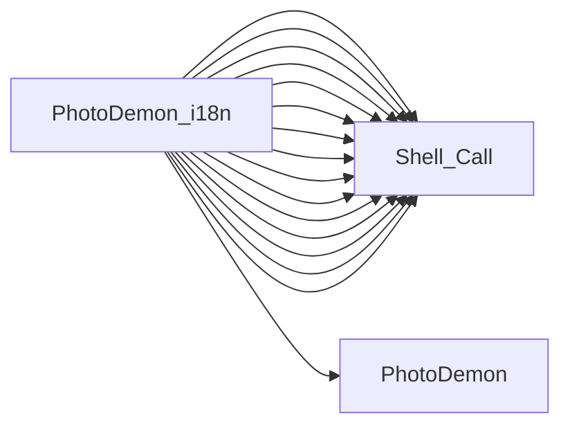

# PhotoDemon_i18n

## Basic Information
- **Exe Name**: `Generate_i18n.exe`
- **Project Path**: `../sample_data/photodemon/Support/i18n-manager/Generate_i18n.vbp`

## At a Glance
- **Executable**: `Generate_i18n.exe`
- **Forms**: 1
- **Modules**: 9
- **Outbound calls**: 16
- **Jump to**: [Components](#components) | [Connections](#connections)

## Components

=== "Forms (1)"
    - `frmGenerateI18N.frm`

=== "Modules (9)"
    - `Files.bas`
    - `LocalizationPlaceholder.bas`
    - `Interface_Placeholder.bas`
    - `OS.bas`
    - `PDDebug_Placeholder.bas`
    - `Strings.bas`
    - `UserPrefs_Placeholder.bas`
    - `TextSupport.bas`
    - `VB_Hacks_StrippedDown.bas`
## Connections
### Outbound Calls
This project calls the following external executables:

| Target | Source File | Line | Context | Content |
| :--- | :--- | :---: | :--- | :--- |
| `Shell_Call` (Unknown) | [Files.bas](sources/PhotoDemon_i18n/Files_bas.md) | - | _N/A_ | `leftHandCall=[name=[ShellAndWait], procedure=[name=[ShellAndWait]]]` |
| [PhotoDemon](PhotoDemon.md) | [OS.bas](sources/PhotoDemon_i18n/OS_bas.md#L620) | 620 | `'Conditionally add it to the string stack, depending on the removeExePath setting / If removeExePath Then / If (InStr(1, tmpString, "PhotoDemon.exe", vbBinaryCompare) = 0) Then dstStringStack.AddString tmpString / Else / dstStringStack.AddString tmpString` | `If (InStr(1, tmpString, "PhotoDemon.exe", vbBinaryCompare) = 0) Then dstStringStack.AddString tmpString` |
| `Shell_Call` (Unknown) | [cFileDialogVista.cls](sources/PhotoDemon_i18n/cFileDialogVista_cls.md) | - | _N/A_ | `leftHandCall=[name=[oIShellItem], variable=[name=[oIShellItem]]]` |
| `Shell_Call` (Unknown) | [cFileDialogVista.cls](sources/PhotoDemon_i18n/cFileDialogVista_cls.md) | - | _N/A_ | `leftHandCall=[name=[oIShellItem], variable=[name=[oIShellItem]]]` |
| `Shell_Call` (Unknown) | [cFileDialogVista.cls](sources/PhotoDemon_i18n/cFileDialogVista_cls.md) | - | _N/A_ | `leftHandCall=[name=[oIShellItem], variable=[name=[oIShellItem]]]` |
| `Shell_Call` (Unknown) | [cFileDialogVista.cls](sources/PhotoDemon_i18n/cFileDialogVista_cls.md) | - | _N/A_ | `leftHandCall=[name=[oIShellItem], variable=[name=[oIShellItem]]]` |
| `Shell_Call` (Unknown) | [cFileDialogVista.cls](sources/PhotoDemon_i18n/cFileDialogVista_cls.md) | - | _N/A_ | `leftHandCall=[name=[oIShellItem], variable=[name=[oIShellItem]]]` |
| `Shell_Call` (Unknown) | [cFileDialogVista.cls](sources/PhotoDemon_i18n/cFileDialogVista_cls.md) | - | _N/A_ | `leftHandCall=[name=[oIShellItem], variable=[name=[oIShellItem]]]` |
| `Shell_Call` (Unknown) | [cFileDialogVista.cls](sources/PhotoDemon_i18n/cFileDialogVista_cls.md) | - | _N/A_ | `leftHandCall=[name=[IShellItem_GetDisplayName], procedure=[name=[IShellItem_GetDisplayName]]]` |
| `Shell_Call` (Unknown) | [cFileDialogVista.cls](sources/PhotoDemon_i18n/cFileDialogVista_cls.md) | - | _N/A_ | `leftHandCall=[name=[IShellItem_GetDisplayName], procedure=[name=[IShellItem_GetDisplayName]]]` |
| `Shell_Call` (Unknown) | [cFileDialogVista.cls](sources/PhotoDemon_i18n/cFileDialogVista_cls.md) | - | _N/A_ | `leftHandCall=[name=[IShellItem_GetParent], procedure=[name=[IShellItem_GetParent]]]` |
| `Shell_Call` (Unknown) | [cFileDialogVista.cls](sources/PhotoDemon_i18n/cFileDialogVista_cls.md) | - | _N/A_ | `leftHandCall=[name=[IShellItem_AreEqual], procedure=[name=[IShellItem_AreEqual]]]` |
| `Shell_Call` (Unknown) | [cFileDialogVista.cls](sources/PhotoDemon_i18n/cFileDialogVista_cls.md) | - | _N/A_ | `leftHandCall=[name=[IShellItem_PointerToVBObject], procedure=[name=[IShellItem_PointerToVBObject]]]` |
| `Shell_Call` (Unknown) | [cFileDialogVista.cls](sources/PhotoDemon_i18n/cFileDialogVista_cls.md) | - | _N/A_ | `leftHandCall=[name=[pvGetIShellItem], procedure=[name=[pvGetIShellItem]]]` |
| `Shell_Call` (Unknown) | [cFileDialogVista.cls](sources/PhotoDemon_i18n/cFileDialogVista_cls.md) | - | _N/A_ | `leftHandCall=[name=[pvGetIShellItem], procedure=[name=[pvGetIShellItem]]]` |
| `Shell_Call` (Unknown) | [cFileDialogVista.cls](sources/PhotoDemon_i18n/cFileDialogVista_cls.md) | - | _N/A_ | `leftHandCall=[name=[pvGetIShellItem], procedure=[name=[pvGetIShellItem]]]` |

### Dependency Graph

