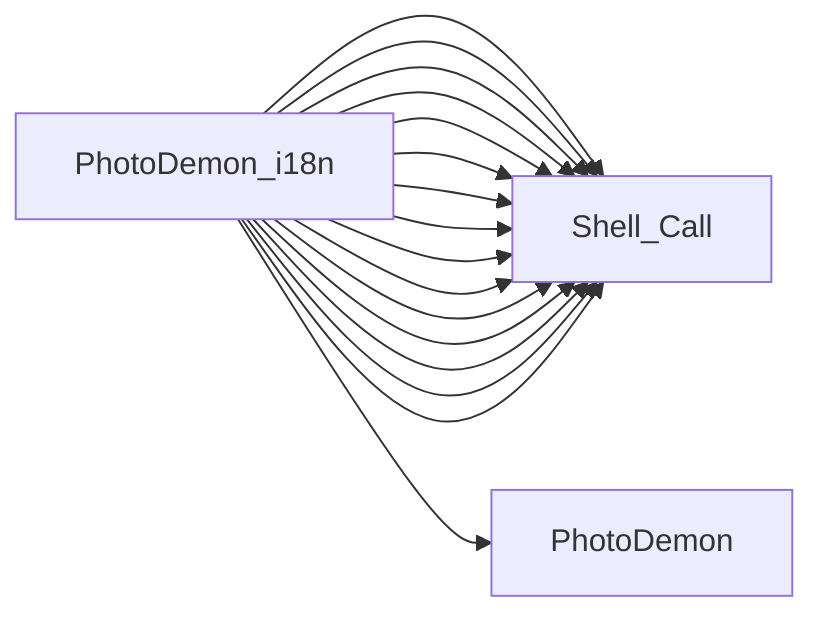

# PhotoDemon_i18n

## Basic Information
- **Exe Name**: `Generate_i18n.exe`
- **Project Path**: `../sample_data/photodemon/Support/i18n-manager/Generate_i18n.vbp`

## Components
### Forms (1)
- `frmGenerateI18N.frm`

### Modules (9)
- `Files.bas`
- `LocalizationPlaceholder.bas`
- `Interface_Placeholder.bas`
- `OS.bas`
- `PDDebug_Placeholder.bas`
- `Strings.bas`
- `UserPrefs_Placeholder.bas`
- `TextSupport.bas`
- `VB_Hacks_StrippedDown.bas`
## Connections
### Outbound Calls
This project calls the following external executables:

| Target | Source File | Line | Content |
| :--- | :--- | :---: | :--- |
| `Shell_Call` (Unknown) | `Files.bas` | 0 | `leftHandCall=[name=[ShellAndWait], procedure=[name=[ShellAndWait]]]` |
| [PhotoDemon](PhotoDemon.md) | `OS.bas` | 620 | `If (InStr(1, tmpString, "PhotoDemon.exe", vbBinaryCompare) = 0) Then dstStringStack.AddString tmpString` |
| `Shell_Call` (Unknown) | `cFileDialogVista.cls` | 0 | `leftHandCall=[name=[oIShellItem], variable=[name=[oIShellItem]]]` |
| `Shell_Call` (Unknown) | `cFileDialogVista.cls` | 0 | `leftHandCall=[name=[oIShellItem], variable=[name=[oIShellItem]]]` |
| `Shell_Call` (Unknown) | `cFileDialogVista.cls` | 0 | `leftHandCall=[name=[oIShellItem], variable=[name=[oIShellItem]]]` |
| `Shell_Call` (Unknown) | `cFileDialogVista.cls` | 0 | `leftHandCall=[name=[oIShellItem], variable=[name=[oIShellItem]]]` |
| `Shell_Call` (Unknown) | `cFileDialogVista.cls` | 0 | `leftHandCall=[name=[oIShellItem], variable=[name=[oIShellItem]]]` |
| `Shell_Call` (Unknown) | `cFileDialogVista.cls` | 0 | `leftHandCall=[name=[oIShellItem], variable=[name=[oIShellItem]]]` |
| `Shell_Call` (Unknown) | `cFileDialogVista.cls` | 0 | `leftHandCall=[name=[IShellItem_GetDisplayName], procedure=[name=[IShellItem_GetDisplayName]]]` |
| `Shell_Call` (Unknown) | `cFileDialogVista.cls` | 0 | `leftHandCall=[name=[IShellItem_GetDisplayName], procedure=[name=[IShellItem_GetDisplayName]]]` |
| `Shell_Call` (Unknown) | `cFileDialogVista.cls` | 0 | `leftHandCall=[name=[IShellItem_GetParent], procedure=[name=[IShellItem_GetParent]]]` |
| `Shell_Call` (Unknown) | `cFileDialogVista.cls` | 0 | `leftHandCall=[name=[IShellItem_AreEqual], procedure=[name=[IShellItem_AreEqual]]]` |
| `Shell_Call` (Unknown) | `cFileDialogVista.cls` | 0 | `leftHandCall=[name=[IShellItem_PointerToVBObject], procedure=[name=[IShellItem_PointerToVBObject]]]` |
| `Shell_Call` (Unknown) | `cFileDialogVista.cls` | 0 | `leftHandCall=[name=[pvGetIShellItem], procedure=[name=[pvGetIShellItem]]]` |
| `Shell_Call` (Unknown) | `cFileDialogVista.cls` | 0 | `leftHandCall=[name=[pvGetIShellItem], procedure=[name=[pvGetIShellItem]]]` |
| `Shell_Call` (Unknown) | `cFileDialogVista.cls` | 0 | `leftHandCall=[name=[pvGetIShellItem], procedure=[name=[pvGetIShellItem]]]` |

### Dependency Graph

