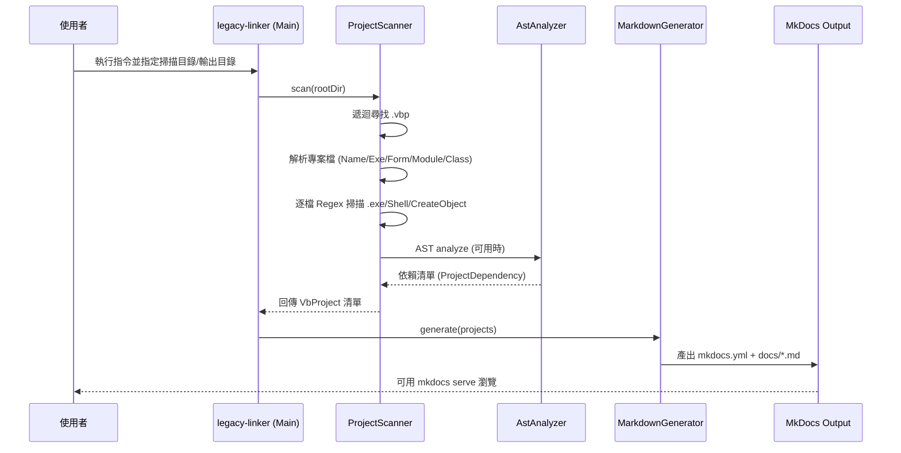

# System Flow（系統流程）

## 流程總覽

## 逐步說明

### 1) 使用者啟動與參數輸入
使用者透過 CLI 指令傳入 VB6 根目錄與輸出目錄，系統啟動掃描流程。 【F:legacy_linker/src/main/java/com/legacy/linker/Main.java†L15-L45】

### 2) 專案掃描與解析
- `ProjectScanner` 遞迴尋找 `.vbp` 檔案。 【F:legacy_linker/src/main/java/com/legacy/linker/scanner/ProjectScanner.java†L14-L23】
- 解析 `.vbp` 以取得專案名稱、EXE 名稱、表單/模組/類別檔案清單。 【F:legacy_linker/src/main/java/com/legacy/linker/scanner/ProjectScanner.java†L25-L64】

### 3) 依賴掃描
- **Regex 掃描**：對所有來源檔逐行搜尋 `.exe`、`shell`、`createobject`。 【F:legacy_linker/src/main/java/com/legacy/linker/scanner/ProjectScanner.java†L99-L136】
- **AST 分析**：若能成功解析，會在 Procedure 範圍內偵測 `Shell` 與 `CreateObject` 呼叫。 【F:legacy_linker/src/main/java/com/legacy/linker/scanner/AstAnalyzer.java†L200-L246】

### 4) 產生分析模型
掃描結果會被整理為 `VbProject` 與 `ProjectDependency`，其中包含專案資訊與對外呼叫依賴。 【F:legacy_linker/src/main/java/com/legacy/linker/scanner/ProjectScanner.java†L66-L97】

### 5) 文件輸出與可視化
- `MarkdownGenerator` 產出 MkDocs 結構、專案頁、依賴圖與 AST 摘要。 【F:legacy_linker/src/main/java/com/legacy/linker/generator/MarkdownGenerator.java†L26-L336】
- 最終可透過 `mkdocs serve` 進行本地瀏覽。 【F:legacy_linker/README.md†L64-L87】

## 產出重點

| 產出項目 | 說明 |
| --- | --- |
| `docs/index.md` | 首頁與專案總覽 |【F:legacy_linker/src/main/java/com/legacy/linker/generator/MarkdownGenerator.java†L94-L140】|
| `docs/dependencies.md` | 全域依賴關係圖 |【F:legacy_linker/src/main/java/com/legacy/linker/generator/MarkdownGenerator.java†L214-L254】|
| `docs/ast_summary.md` | AST 分析摘要 |【F:legacy_linker/src/main/java/com/legacy/linker/generator/MarkdownGenerator.java†L256-L259】|
| 專案頁與來源檔 | 逐專案依賴表與原始碼索引 |【F:legacy_linker/src/main/java/com/legacy/linker/generator/MarkdownGenerator.java†L142-L212】【F:legacy_linker/src/main/java/com/legacy/linker/generator/MarkdownGenerator.java†L336-L395】|
